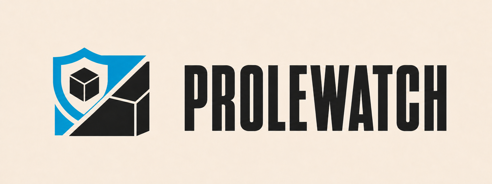
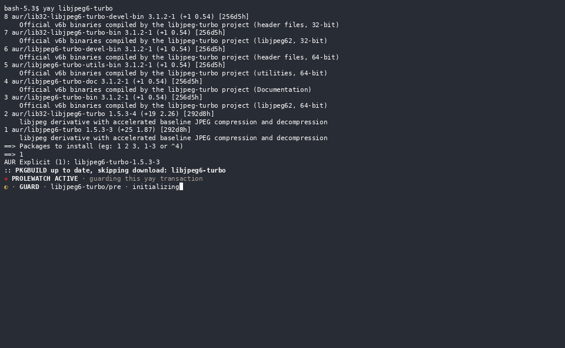
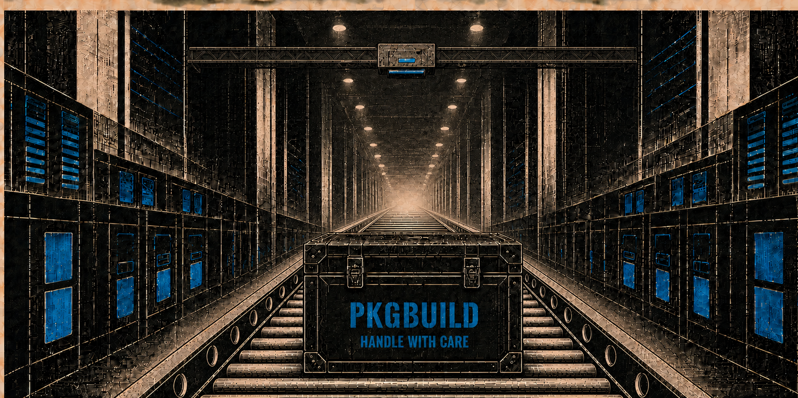
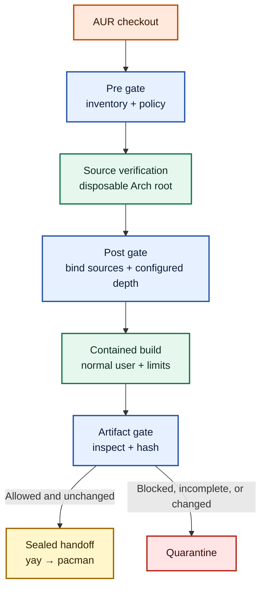
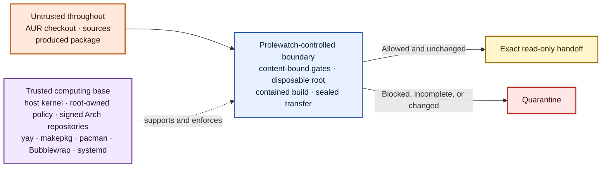
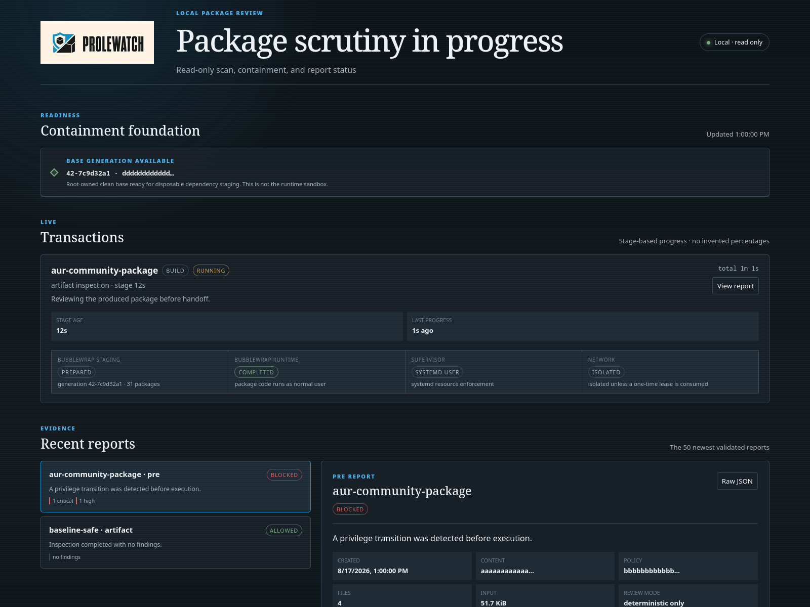

# Prolewatch

<p align="center">
  
</p>

<p align="center">
  <em>If there is hope for Linux, it lies in its community.</em><br>
  <strong>Protect what we build together.</strong>
</p>

<p align="center">
  <a href="https://github.com/holgerjh/prolewatch/actions/workflows/ci.yml"></a>
  <a href="go.mod"></a>
  
  
  <a href="LICENSE"></a>
</p>

Prolewatch adds inspection and containment gates to AUR builds driven by
[`yay`](https://github.com/Jguer/yay). It examines package material before it
runs, builds inside a disposable Arch userspace, and inspects the resulting
package before handing it back for installation.

It is not a replacement: `yay` still resolves and orders the transaction, while `makepkg` interprets
the `PKGBUILD` and runs its standard phases. Prolewatch only controls the security
boundary around those steps.

The AUR's openness is its strength. Like any open software ecosystem, it can be
targeted through compromised accounts, hostile upstreams, or misleading
packages. The sourced **[AUR threat model and incident map](docs/aur-threat-model.md)**
connects those controls to represented attacks, documents their exact claim
boundaries, and tracks the risks that remain.

The name is a reference to George Orwell's *1984*, where the proles are
ordinary people outside the Party's power structure. For this project, the
reference points to the users, maintainers, and contributors who keep Linux
and the AUR working.


## What it does

> [!WARNING]
> Prolewatch is experimental and a work in progress. It has not received an
> independent security audit and does not certify AUR packages as safe. In
> particular, AI-review prompts, provider- and model-specific calibration,
> confidence thresholds, and evaluation coverage are still evolving and will
> be refined in future releases. Start on an isolated Arch Linux system before
> relying on it.

* **Before execution:** Scans package build files, archives, paths, and committed executables before package-controlled code runs.
* **During the build:** Runs package phases as a normal user inside disposable Arch userspace with resource, filesystem, and network limits.
* **Before installation:** Inspects the resulting archive, verifies its hash, and returns only the reviewed read-only artifact to `yay`.


## Security controls

| Control | Effect |
| --- | --- |
| **Deterministic inspection gates** | Fail-closed archive, path, integrity, shell-behavior, containment, and artifact checks run before any heuristic judgement. |
| **Isolated contextual AI review** | A bounded cross-file snapshot can expose intent and composition that narrow signatures miss. |
| **Network-aware build containment** | Prolewatch auto-detects selected allowlisted dependency-fetch operations and enables its bounded public HTTP(S) broker for the matching recipe phase. Ecosystem installers, arbitrary downloaders, and unknown network use remain offline unless they receive a separate, exact lease. |
| **Sealed package handoff** | The built archive is inspected, hashed, copied read-only, and reverified before it reaches the final package transaction. |

<p align="center">
  
</p>

<p align="center"><em>A complete yay transaction.</em></p>

Prolewatch covers a narrower scope than a general malware or trust service:

| It helps reduce | It does not establish |
| --- | --- |
| <ul><li>Recognizable malicious package content</li><li>Archive and path escapes</li><li>Uncontrolled build egress and host-path access</li><li>Resource exhaustion</li><li>Artifact replacement</li></ul> | <ul><li>Maintainer identity or upstream integrity</li><li>Arbitrary program safety</li><li>Host-kernel isolation</li><li>Runtime safety after installation</li><li>Freedom from false negatives or false positives</li></ul> |

## Build review flow



| Stage | Prolewatch action | Purpose |
| --- | --- | --- |
| Before source processing | Inventories the AUR checkout and applies deterministic rules; optionally performs isolated AI review | Stops hard-blocked structures and recognized dangerous behavior before package code runs |
| After source retrieval | Binds exact vendor-source bytes, records provenance and verification, and applies the configured vendor scan depth | Applies a fresh decision to newly arrived material; upstream source review does not establish vendor safety |
| During the build | Runs package-controlled phases as the normal user inside Bubblewrap, a disposable root, resource limits, and a selective network boundary | Auto-enables a bounded broker for the allowlisted `cargo fetch --locked` shape while keeping ecosystem installers, arbitrary downloaders, and unknown egress offline by default |
| Before installation | Inspects produced package archives, verifies their hashes during transfer, and returns only a sealed read-only handoff | Prevents an inspected artifact from being silently replaced before `yay` gives it to `pacman` |

Inspection gates apply deterministic rules first and can add isolated AI
detection for contextual cross-file signals. AI cannot override deterministic
hard blocks. The user-facing decision is always explicit: ordinary passes are
`ALLOW`, while a lower-confidence AI pass permitted by local policy is shown as
`AUTO-ALLOW` together with both confidence values.



Vendor source content is accepted without semantic inspection by default
(`vendor.scan_depth: 0`). Prolewatch still records its declared checksum or VCS
binding, the observed SHA-256, transport, and `makepkg` verification result.
Depth `1` inspects direct vendor content, depth `2` also opens one nested archive,
and so on. This setting never weakens the AUR checkout scan or the final
`.pkg.tar.*` artifact gate.

### Trust boundary

Package-controlled material remains untrusted throughout the transaction.
Prolewatch's controls depend on an explicit trusted computing base. The
scanner cannot validate the components that enforce its own boundary.



Bubblewrap shares the host kernel; it is not a virtual machine. The full
process, privilege, network, Pacman-hook, and sealing model is documented in
the [technical architecture guide](docs/architecture.md).

### Local dashboard

Run `prolewatch web` to open the local, read-only dashboard. It shows the
current stage and elapsed time, scan counters, provider deadlines, privileged
dependency staging, normal-user package execution, validated findings, and
sandbox evidence.



<p align="center"><em>Read-only UI dashboard</em></p>

## Review modes

Deterministic inspection always runs first. The active mode is part of the
policy fingerprint, so changing it invalidates decisions made under the old
policy.

| Capability | `ai` | `deterministic-only` |
| --- | --- | --- |
| Deterministic inventory, archive checks, hard blocks, containment, artifact inspection, and sealing | Yes | Yes |
| Contextual review of a bounded snapshot | Isolated configured provider CLI | No provider is invoked |
| Provider outage or malformed response | Fails closed | Not applicable |
| Structural hard blocks | Not eligible for a normal approval | Not eligible for a normal approval |
| Best fit | Additional cross-file context | Offline, private, reproducible, or provider-free operation |

AI review is a fallible heuristic. It receives selected bounded content rather
than a mount of the package tree, and it cannot override deterministic hard
blocks. Neither mode proves that a package is safe.

### Decisions and interactive control

`review.minimum_confidence` defaults to `high`; AI allows that meet the
configured threshold proceed automatically, approval-eligible blocks require
explicit one-time confirmation for the exact snapshot, and structural or trust
failures remain blocked by default. See the [User Guide](docs/user-guide.md#decision-confidence-and-interactive-control)
for confidence levels, decision bindings, the administrator-only unsafe bypass,
and non-TTY behavior.

## Reproducible security evidence

The repository includes harmless synthetic packages for security-relevant AUR
techniques and important control cases. `make scenarios` runs them through the
same deterministic scanner and policy used by Prolewatch without executing a
`PKGBUILD`, install script, downloaded command, native fixture, or archive
member.

```bash
make scenarios
```

| Scenario | Technique | Represents | Expected deterministic result |
| --- | --- | --- | --- |
| [`baseline-safe`](testdata/security-scenarios/baseline-safe/) | Control | Benign control package | Allow with no findings |
| [`network-warning`](testdata/security-scenarios/network-warning/) | Control | Build-time network use outside source verification | Allow with a visible warning |
| [`aur-2018-remote-pipeline`](testdata/security-scenarios/aur-2018-remote-pipeline/) | [`T01`](docs/aur-threat-model.md#t01) | Direct `curl \| bash`-style execution | Non-approval-eligible hard block |
| [`aur-2025-remote-source`](testdata/security-scenarios/aur-2025-remote-source/) | [`T01`](docs/aur-threat-model.md#t01) | Representative remote second-stage sourcing | Non-approval-eligible hard block |
| [`aur-2026-install-ecosystem`](testdata/security-scenarios/aur-2026-install-ecosystem/) | [`T02`](docs/aur-threat-model.md#t02) | Ecosystem installer launched from an install script | Non-approval-eligible hard block |
| [`aur-2026-atomic-arch`](testdata/security-scenarios/aur-2026-atomic-arch/) | [`T02`](docs/aur-threat-model.md#t02) | Documented Atomic Arch npm and Bun indicators | Non-approval-eligible indicator and installer blocks |
| [`aur-2026-native-binary`](testdata/security-scenarios/aur-2026-native-binary/) | [`T04`](docs/aur-threat-model.md#t04) | Native executable committed to the package workspace | Approval-eligible high-severity block; format recognition alone does not prove behavior |
| [`aur-2026-native-sudo`](testdata/security-scenarios/aur-2026-native-sudo/) | [`T04`](docs/aur-threat-model.md#t04), [`T06`](docs/aur-threat-model.md#t06) | Native executable combined with an explicit privilege transition | Non-approval-eligible privilege hard block plus the binary finding |
| [`structural-escapes`](testdata/security-scenarios/structural-escapes/) | [`T07`](docs/aur-threat-model.md#t07) | Escaping symlink and archive-member paths | Non-approval-eligible structural hard blocks |

A scenario `PASS` means the declared decision, findings, approval eligibility,
and coverage state matched for those synthetic bytes. It does not claim that
every variation of an attack family is detected. See the
[scenario methodology](docs/security-scenarios.md) and the sourced
[AUR threat model](docs/aur-threat-model.md) for the exact claim boundaries.

After installing the same Prolewatch version as the checkout and completing
`prolewatch install-hook`, run the host-safe installed acceptance check as the
normal yay user:

```bash
make installed-scenarios
```

It verifies the exact installed version, runs `doctor --no-probe`, and evaluates
the complete deterministic corpus through `/usr/bin/prolewatch`. It does not
execute fixture content, make a live AI request, write reports or markers, or
change the package database.

## Quick start

Arch Linux is the supported platform. Start on an isolated test system and
install the common dependencies:

```bash
sudo pacman -S --needed base-devel devtools go git bubblewrap libarchive gnupg sudo
```

`yay` must already be installed. For the default Codex-backed review mode,
install a supported `openai-codex` package as well. Then build Prolewatch as the
normal `yay` user:

```bash
git clone https://github.com/holgerjh/prolewatch.git
cd prolewatch
go mod verify
make test vet build
```

Install the system boundary:

```bash
sudo ./scripts/install-system.sh --review-mode ai --provider codex
```

Authenticate Codex separately as the locked `prolewatch` account:

```bash
sudo -u prolewatch env \
  HOME=/var/lib/prolewatch/providers/codex \
  CODEX_HOME=/var/lib/prolewatch/providers/codex \
  /usr/bin/codex login --device-auth
```

Finish as the normal user:

```bash
prolewatch install-hook
prolewatch doctor
```

For a provider-free installation, replace the system-install command with:

```bash
sudo ./scripts/install-system.sh --review-mode deterministic-only
```

The installer is interactive by default. It validates the required boundary,
prints the exact root and locked-account sudo rules it will install, and
requires typed confirmation. For reviewed automation, `-y` or
`--assume-yes` skips only that confirmation and permits non-TTY execution;
all preflight and safety checks still run. The default `brand` terminal style
uses the same blue, amber, and green inspection language as the dashboard;
pass `--terminal-style plain` to disable it. Redirected output and `TERM=dumb`
stay byte-stable and plain. `NO_COLOR` removes color while retaining structural
status markers. The installer does not install or authenticate a provider. See the
[User Guide](docs/user-guide.md) for complete requirements, Anthropic setup,
mode switching, existing-provider semantics, updates, and troubleshooting.

## Everyday use

Use `yay` normally:

```bash
yay -S package-name
```

On an interactive terminal, the first protected pre-scan prints one compact
`PROLEWATCH ACTIVE` marker for the whole `yay` transaction. While a gate is
running, one live line shows the actual stage, package, observed file/byte and
archive counters, AI batch, and applicable deadline. During sandbox execution,
the latest sanitized child-process line replaces the outer command, so long
compiles expose concrete activity without allowing package-controlled terminal
escapes. A small rotating wheel is a heartbeat for the live status line, not a
claim of measurable progress. The line never invents a percentage or labels an
agent as stuck; a reached deadline is shown explicitly while the fail-closed
timeout handling completes. It is cleared before reports and prompts.

Inspect reports or start the dashboard:

```bash
prolewatch report --latest
prolewatch report REPORT_ID
prolewatch web
```

Eligible non-structural findings and build-time network access that was not
recognized for automatic policy use separate one-time decisions:

```bash
prolewatch approve REPORT_ID
prolewatch allow-network POST_REPORT_ID
```

An approval never grants network access, a network lease never approves a
finding, and neither creates a reusable package allowlist.

For a clean reinstall, run `prolewatch uninstall-hook` as the normal user
before `sudo ./scripts/uninstall-system.sh`. The latter removes the installed
system configuration but preserves credentials, clean roots, and
user audit history; the [uninstall guide](docs/user-guide.md#uninstalling)
explains the optional full-state purge.

## Documentation

| I want to… | Read |
| --- | --- |
| Install, configure, update, or troubleshoot Prolewatch | [User Guide](docs/user-guide.md) |
| Understand processes, privileges, clean roots, network boundaries, Pacman behavior, and artifact sealing | [Technical architecture](docs/architecture.md) |
| Inspect or run the harmless deterministic acceptance corpus | [Reproducible security scenarios](docs/security-scenarios.md) |
| Evaluate incident sources, mitigation labels, and residual risk | [AUR threat model and incident map](docs/aur-threat-model.md) |
| Contribute code or disclose AI-assisted work | [Contributing](CONTRIBUTING.md) |

## Important limitations

- Deterministic and AI inspection can miss malicious behavior and can block
  benign packages.
- Prolewatch does not establish maintainer, source-host, signing-key, or
  upstream trust.
- The host kernel, root-owned policy, signed repositories, local toolchain,
  `yay`, `makepkg`, `pacman`, Bubblewrap, and systemd remain trusted components.
- Resource and egress limits reduce exposure; they cannot eliminate denial of
  service, sandbox defects, or kernel compromise.
- Host `pacman` still installs the final package with package-management
  privileges. Prolewatch is not a runtime endpoint-security product.

If package-controlled code may already have run, a later clean report is not
evidence that the host is clean. Follow the relevant incident guidance and
perform normal incident response.

## Development and releases

Run the complete local gate with:

```bash
make release-check
```

It verifies modules, runs reachability-aware vulnerability analysis, race
tests, vet, shell checks, the public security scenarios, and the security-code
coverage threshold. It also produces deterministic Linux binaries and
CycloneDX SBOMs for all six production executables. CI runs the same gate.

The private reporting process and any confirmed open findings are maintained in
[SECURITY.md](SECURITY.md); remediated entries remain available in Git history.

## License

Copyright (C) 2026 Holger Heinz.

Prolewatch is licensed under the [GNU Affero General Public License, version 3
only](LICENSE) (`AGPL-3.0-only`). Commercial use under the AGPL is allowed when
its conditions are met. Organizations that need proprietary terms or an
exception from the AGPL's copyleft obligations can request a
[separate commercial license](COMMERCIAL-LICENSE.md).

External code contributions require a contributor license agreement. See
[CONTRIBUTING.md](CONTRIBUTING.md) for the current contribution policy.
Third-party components remain under their respective licenses; required
notices are collected in [`THIRD_PARTY_NOTICES`](THIRD_PARTY_NOTICES).

## Development transparency

Prolewatch is human-directed and human-maintained. Generative AI coding
assistants have been used for implementation, debugging, documentation,
and review. Human maintainers decide which changes are accepted before they are included.

