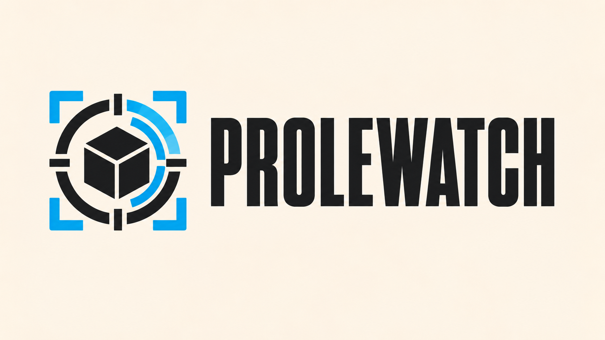
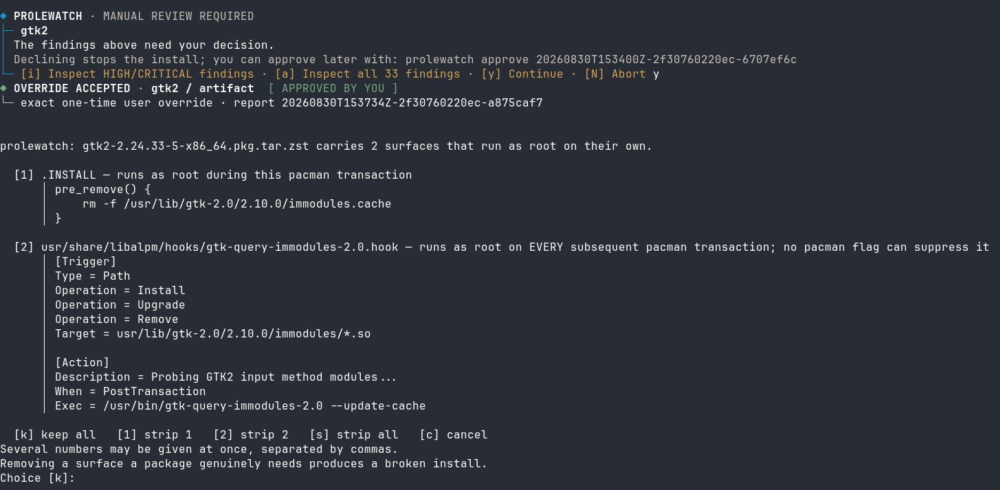
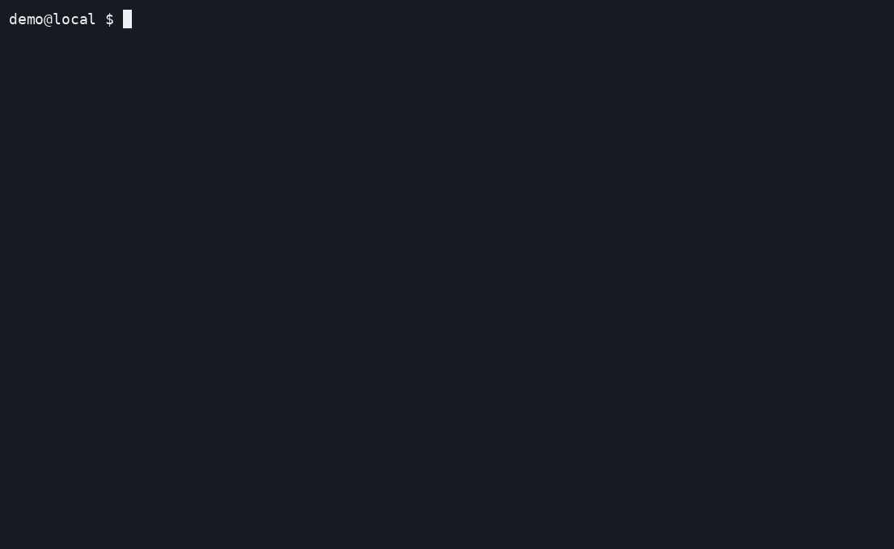

# Prolewatch

<p align="center">
  
</p>

<p align="center">
  <strong>Contain the build. See what runs as root.</strong>
</p>

<p align="center">
  <a href="https://github.com/holgerjh/prolewatch/actions/workflows/ci.yml"></a>
  <a href="go.mod"></a>
  
  
  <a href="LICENSE"></a>
</p>

Prolewatch contains AUR builds and inspects packages before installation.
Normally, `makepkg` runs package-controlled code with your user's access, and
`pacman` installs the result as root.

With Prolewatch, builds have no access to your home directory or direct network
connection. Declared sources are fetched separately; additional network access
requires approval. Before installation, Prolewatch displays privileged package
integration and asks whether to keep or strip automatic surfaces such as
install scriptlets, pacman hooks, and udev rules.

Prolewatch hooks into `yay` instead of replacing it. `yay` still resolves the
transaction, `makepkg` still builds the package, and the final install stays
your own `sudo pacman -U`. Prolewatch itself installs no daemon, socket, service,
service account, `sudoers` entry, or setuid binary. The optional local Ollama
pilot can use a daemon you separately install and operate as part of your local
trusted computing base.

**Experimental AUR release candidate — publication pending**

The current tree targets `0.12.0` as the first public experimental release for
x86-64 Arch Linux. Publication remains pending until its signed source archive
has passed the disposable-system acceptance run and the recipe has been pushed
to the AUR.

> [!WARNING]
> Prolewatch is experimental and has not been independently audited. It does not
> certify AUR packages as safe.
> See [Development and testing](#development-and-testing) and, if in doubt, start on an
> isolated Arch Linux system before relying on it.

## Examples

### A contained AUR build

Prolewatch reviews the recipe, prompts for network access, and contains
package-controlled code during source acquisition and the build. Installation
uses your own `sudo pacman -U`.

<p align="center">
  <a href="docs/images/prolewatch-basic.gif"></a>
</p>

<p align="center"><em>Contained AUR build</em></p>

### Reviewing privileged package integration

This `gtk2` package ships an install scriptlet and a pacman hook. Prolewatch
shows their code before handing the archive to `pacman`, and lets you keep or
strip them.

<p align="center">
  <a href="docs/images/prolewatch-root-gate.png"></a>
</p>

<p align="center"><em>The privileged-integration gate · gtk2 2.24.33-5</em></p>

### Detection, inspection, and AI guidance

AI review is optional and off by default. This is what it adds when you turn it
on. The `moon-buggy` recipe contains several `eval` statements. Prolewatch finds
them without any provider, requires a decision, opens the verified read-only
inspection, and puts bounded AI guidance beside each exact finding.

<p align="center">
  <a href="docs/images/prolewatch-ai-guidance.gif"></a>
</p>

<p align="center"><em>Detection and contextual guidance</em></p>

## How it works

Five controls sit between `yay` resolving a transaction and your own
`sudo pacman -U`.

### 1. Build isolation

Package-controlled code runs in a user namespace with a temporary home,
enumerated `/etc`, read-only `/usr`, no capabilities, private process and
network namespaces, and hard limits on memory, CPU, tasks, runtime, file size,
and the whole process tree.

Your SSH keys, GnuPG directory, and browser profiles are outside the build's
scope. These restrictions apply regardless of whether inspection recognises
malicious code.

A separate build account also isolates your personal files, but needs additional
controls for persistent state, network access, and resource use. Prolewatch
applies those controls within your existing `yay` workflow.

### 2. Source downloads and network access

Prolewatch evaluates the `PKGBUILD` inside containment, freezes its declared
source set, and fetches those sources on the trusted side before the build
phases run. A recipe that computes a different URL later fails closed.

The build has no direct egress. When a phase does reach for the network, the
first public HTTP(S) destination stops the build and asks you, in your terminal,
separated from package output. A grant is bound to that transaction and that
destination; a later phase gets a fresh broker and asks again.
Cargo and Go detection adds context to that question and never grants access on
its own.

### 3. Recipe, source, and package inspection

Prolewatch inventories the AUR checkout, the sources that arrived, and the
finished package, then reports recognised behavior at full severity. Structurally
decidable failures stop outright: archive traversal, escaping symlinks, special
files, content-binding failures.

Vendor content is not scanned semantically by default (`vendor.scan_depth: 0`).
Depth `1` scans direct vendor content, depth `2` opens one nested archive, and so
on. The checkout and the final artifact are always scanned.

Every gate prints a report id, and a gate that stops you offers `[i]` for the
findings above your decision threshold and `[a]` for all of them. To read a
report that did not stop you, or to read one again afterwards:

```bash
prolewatch inspect --latest
prolewatch inspect <report id>
```

That reopens the findings with their source context and any AI guidance, without
approving anything or contacting a provider. `prolewatch report <report id>`
prints the report itself.

### 4. Optional AI guidance

By default, `review.mode` is `deterministic-only`: inspection runs locally
without contacting an AI provider.

Set it to `ai` and Prolewatch adds a contextual pass after deterministic
inspection, at the gates you select. Codex and Anthropic use a provider CLI,
your account and quota; the Ollama pilot uses one exact local model digest
through a fixed loopback API, so package content stays local and no provider
account is required.

The provider receives the manifest, source-verification status, deterministic
findings, selected text, and a bounded context window. It does not receive a
mount of the package tree. The built-in read-only inspector shows each finding
beside a short, clearly separated AI comment, anchored to the displayed
occurrence by an exact quote; a comment that fails to match is discarded.

AI can turn an allow into a decision. It can never clear a deterministic
finding, and a provider that fails or times out leaves the install proceeding on
deterministic grounds alone. Deterministic inspection runs at every gate no
matter which gates AI is enabled for. This is contextual review, not runtime
monitoring.

Turning it on, choosing gates, and the local models that passed the safety
corpus are in [Turn on AI review](#4-turn-on-ai-review).

### 5. Privileged-integration review

Before installation Prolewatch enumerates every known root-relevant surface in
the finished `.pkg.tar.zst`, and shows all of them. It *stops* only for the ones
that run as root, or grant privilege, with no further step by anyone: install
scriptlets, `libalpm` hooks, udev rules, `sysusers.d`, `tmpfiles.d`, generators,
`sudoers` drop-ins. A systemd unit nobody has enabled, a user-session unit, a
polkit action declaration, a PAM module nothing references: those are printed
and passed.

Limiting prompts to automatic integration reduces repeated questions about
services that still require explicit activation.

When the gate opens, keep everything or strip any listed member before `yay`
hands the archive to `pacman`. A package carrying one of those surfaces needs a
terminal, so an unattended install stops there.

## Installation

> [!IMPORTANT]
> **AUR publication is pending.** The intended `0.12.0` release uses a
> maintainer-signed, vendored source archive and an AUR recipe pinned to the
> maintainer fingerprint. Until the package page is live and this notice is
> updated, use the development installation below from a checkout you have
> reviewed. See [SECURITY.md](SECURITY.md) for the trust boundary.

The supported target for the first release is x86-64 Arch Linux. The Linux
amd64 binaries and binary archive attached by GitHub Actions are verification
artifacts, not installable distributions: they do not include the `Makefile`,
packaging scripts, or an installer, and copying the binaries alone would omit
required policy and shared files. Their checksums and GitHub attestations cover
those workflow-built artifacts. The separately uploaded AUR source archive is
verified by the checksum and GPG signature in the recipe.

Prolewatch installs four unprivileged binaries and its policy file.

### 1. Install the package

#### Signed AUR release, after publication

The release will publish these separate assets at the `v0.12.0` GitHub
prerelease:

- `prolewatch-0.12.0.tar.gz`
- `prolewatch-0.12.0.tar.gz.sig`
- `prolewatch-release-key.asc`

The automatic GitHub "Source code" downloads and the workflow-built binary
archive are different files and cannot replace the signed source archive.

The full release-key fingerprint is:

```text
296E983E7120909958BD38E557F1F87148E02B27
```

After publication, download the public key from the release, inspect its full
fingerprint, compare it with both documents through a separate path, and import
it as the normal build user:

```bash
curl --fail --location --remote-name \
  https://github.com/holgerjh/prolewatch/releases/download/v0.12.0/prolewatch-release-key.asc
gpg --show-keys --with-fingerprint prolewatch-release-key.asc
gpg --import prolewatch-release-key.asc
yay -S prolewatch
```

No `pacman-key` import or GPG ownertrust change is needed. The recipe's
`validpgpkeys` entry requires the exact release fingerprint when `makepkg`
checks the detached source signature. Importing the public key only makes that
verification possible; comparing the fingerprint is the identity check.

#### Development installation from a reviewed checkout

The build produces an ordinary Arch package, which you sign with a key you
generate yourself. That signature authenticates *your own build artifact* to
`pacman`. It says nothing about the source it was built from. Install the source
checkout prerequisites first:

```bash
sudo pacman -Syu --needed base-devel git go
```

Run as the normal `yay` user, from an interactive shell:

```bash
make dev-install
```

The command creates the signing key if there is not one, builds
and signs the package, verifies that signature directly against the private
development key home, checks the installed-file allow-list, and gives only the
final `pacman -U` invocation that key home. Re-running reuses the existing key,
so it is also how you rebuild after a change. The default path modifies neither
the system pacman keyring nor `/etc/pacman.conf`.

Stock Arch uses `LocalFileSigLevel = Optional`. That does not make the direct
verification above optional: `dev-install` performs it before installation and
stops on a bad signature. Administrators may still opt into the system-wide
`Required TrustedOnly` policy with `PROLEWATCH_SET_PACMAN_SIGLEVEL=1`; the old
configuration is kept as `/etc/pacman.conf.prolewatch-bak`. Be aware that this
policy rejects unsigned local packages, including normal `makepkg` output, so
ordinary AUR installs fail until it is relaxed again.

Prolewatch's own build is not protected by Prolewatch. It is installed before
any of its controls exist. On the AUR path, the release signature authenticates
the source for that bootstrap build; on the development path, the local
signature authenticates only the package you built. Neither signature contains
the build. Containment begins with the next AUR transaction.

<details>
<summary><strong>Doing it by hand instead</strong></summary>

The individual build, signature-verification, and installation steps are below.

Create the signing key once. `tty` must print a device path, not
`not a tty`. Use `pinentry-tty` rather than `pinentry-curses`: the curses dialog
needs a minimum terminal size and fails with "Screen or window too small" on a
small window or a serial console.

```bash
dev_key_dir="${XDG_DATA_HOME:-$HOME/.local/share}/prolewatch/dev-signing-gnupg"
install -d -m 0700 "$dev_key_dir"
printf '%s\n' 'pinentry-program /usr/bin/pinentry-tty' \
  > "$dev_key_dir/gpg-agent.conf"
chmod 0600 "$dev_key_dir/gpg-agent.conf"
export GPG_TTY="$(tty)"
gpgconf --homedir "$dev_key_dir" --kill gpg-agent
gpg --homedir "$dev_key_dir" \
  --quick-generate-key "Prolewatch local development package" ed25519 sign 1y
fingerprint="$(gpg --homedir "$dev_key_dir" --with-colons --list-secret-keys \
  | awk -F: '/^fpr:/{print $10; exit}')"
printf '%s\n' "$fingerprint" > "$dev_key_dir/fingerprint"
gpg --homedir "$dev_key_dir" --armor --export "$fingerprint" \
  > "$dev_key_dir/public-key.asc"
```

Then build, verify, and install. Verification uses the development key home
directly and does not depend on pacman's global local-file policy:

```bash
make release-check
make arch-package
make verify-arch-package PACKAGE=/absolute/path/to/prolewatch-dev-VERSION-x86_64.pkg.tar.zst
sudo pacman --gpgdir "$dev_key_dir" -U -- /absolute/path/to/prolewatch-dev-VERSION-x86_64.pkg.tar.zst
```

Use the exact `prolewatch-dev-*.pkg.tar.zst` path printed by `make arch-package`.
`verify-arch-package` verifies the detached signature and checks the built
package against an allow-list of installed files. Installation modifies neither
the pacman keyring nor `LocalFileSigLevel`.
The package provides `prolewatch` and will conflict cleanly with a future release
package.

</details>

### 2. Check the session prerequisites

Contained evaluation and builds run as transient `systemd --user` units. This
user manager is a security prerequisite: it enforces the memory, CPU, task,
runtime, file-size, and whole-process-tree kill limits around package-authored
code.

Run `prolewatch setup` and later `yay` commands from a normal TTY, desktop, or
SSH login created through PAM, then verify the current session:

```bash
printf 'XDG_RUNTIME_DIR=%s\n' "${XDG_RUNTIME_DIR:-<unset>}"
systemctl --user show --property=Version
prolewatch doctor --no-probe
```

Do not fix an absent manager by merely exporting `XDG_RUNTIME_DIR`. The runtime
directory and its user bus must belong to a running manager.

<details>
<summary><strong>If there is no user manager: lingering and headless accounts</strong></summary>

For a dedicated or headless account that cannot keep a login session, enable
lingering explicitly:

```bash
account=$(id -un)
uid=$(id -u)
sudo loginctl enable-linger "$account"
sudo systemctl start "user@${uid}.service"
```

Leave the current shell and start a fresh direct TTY or SSH login before running
`doctor` again; `su` and `sudo -iu` may not create the required PAM session
environment even when lingering is enabled. If a direct login is unavailable,
first confirm that the lingering manager has created a runtime directory and user
bus, then reconnect the current shell to that existing manager:

```bash
uid=$(id -u)
runtime_dir="/run/user/${uid}"

if ! test -O "$runtime_dir" ||
   ! test -S "$runtime_dir/bus" ||
   ! test -O "$runtime_dir/bus"; then
  echo "No live user manager owned by uid ${uid} at ${runtime_dir}" >&2
  exit 1
fi

export XDG_RUNTIME_DIR="$runtime_dir"
export DBUS_SESSION_BUS_ADDRESS="unix:path=${runtime_dir}/bus"

systemctl --user show --property=Version
prolewatch doctor --no-probe
```

Run `yay` from this same shell after `doctor` succeeds. These exports only tell
the client how to reach an already running, same-user manager. They do not start
one or make an unowned runtime directory safe. Do not skip the ownership and
socket checks.

Lingering starts the user manager at boot and keeps it, its runtime directory,
user services, and timers available after logout. It grants no root privilege,
but it lets anything already running as that account maintain user-level
persistence and consume resources without an active session. Prefer a normal
login for an everyday account and reserve lingering for a dedicated or headless
one. Disable it when it is no longer needed:

```bash
sudo loginctl disable-linger "$(id -un)"
```

</details>

The sandbox also needs subordinate UID and GID ranges, which existing accounts do
not always have. Only if `setup` or `doctor` reports them missing, let the system
account tools allocate unused ranges:

```bash
sudo usermod --add-subids -- "$(id -un)"
prolewatch doctor
```

Do not choose a numeric range yourself: overlaps let accounts map the same host
IDs, and computing a free range before invoking `sudo` creates a race. The
delegation permits mappings inside user namespaces and grants no host root or
capabilities. `doctor` exercises the real namespace before setup continues.

### 3. Set up yay integration

```bash
prolewatch setup
```

`prolewatch setup` checks the installed files and sandbox before changing `yay`,
then installs and verifies the hook. It changes only `makepkg_bin` and `gpg_bin`;
existing clean, diff, edit, and redownload preferences stay untouched. Its
required resource-envelope probe starts the same kind of transient systemd user
unit a real build uses, so setup fails before changing `yay` when the current
session cannot enforce those limits. Configuration lives at
`/etc/prolewatch/config.yaml` as a pacman backup file. This is a hard cut:
existing `config.json` files are ignored. Edit the YAML file and run
`prolewatch config-check` before relying on the new package.
`prolewatch install-hook` is available when only the lower-level hook step is
wanted.

### 4. Turn on AI review

Optional, and inert until you set `review.mode` to `ai`. What AI review may and
may not decide is in [Optional AI guidance](#4-optional-ai-guidance); provider
setup, cost and tuning are in [AI review](docs/ai-review.md).

#### Choose the gates

The phase choice changes AI coverage, not the deterministic scanner: local
inspection still runs at every gate.

| Configuration value | AI sees | Main benefit | Cost or limitation |
| --- | --- | --- | --- |
| `recipe` | `PKGBUILD`, `.SRCINFO`, install scripts and other AUR recipe files, before source fetch | Small, early review of build/install intent; can stop before downloading anything | Cannot see the fetched upstream implementation, and recipe-specific deterministic rules already cover many common hazards, so routine AI has the smallest marginal benefit here |
| `sources` | Fetched, readable upstream source together with the recipe, before the build | Finds source-level backdoors, unsafe parsing/deserialization and cross-file behavior that may disappear into a compiled binary | Usually the largest input and therefore the slowest local-model phase; generated and final package output does not exist yet |
| `artifact` | The exact built package before `pacman` installs it, including hooks, services, install scripts and shipped readable code | Best single phase for what will actually reach the host and what will later run as root | The contained build has already run, and native binaries can be less explainable than their source |

No phase completely replaces another. Sources preserve the readable
implementation before the build, while the artifact shows which activation
paths and payloads are actually shipped.

To limit local AI review time, enable the gates in this order:

1. **`artifact`: review the installed payload.** This gate sees the finished
   package, including privileged integration. A package usually ships little
   readable code, so this review is relatively quick.
2. **`sources`: review upstream code before compilation.** This gate can find
   behavior that is harder to inspect in a compiled binary. It processes the
   largest and least structured input in the transaction. For
   the local models listed below, the provisional 8 MiB reference projects 13
   to 18 minutes, where recipe and artifact take seconds.
3. **`recipe`: add AI review of the build recipe.** This is a small input, but
   deterministic rules already cover many common `PKGBUILD` patterns, so AI
   review generally adds less here.

A gate without AI keeps deterministic detection and loses only the semantic
findings and context the model would have added.

When a disabled gate needs a manual decision, its prompt offers
`[r] Run AI review now`: one rescan, one AI call, a new content-bound report,
then the question again from the refreshed evidence. It changes no
configuration and does not enable that gate for future packages.

#### Local model results

No model is trusted by default: each one must pass a fixed seven-case safety
corpus bound to its exact digest. A case passes when the model reaches the
correct verdict. It can pass and still be marked, because a finding has to name
the exact dangerous line: a model that blocks correctly but points one line off
sends the inspector to the wrong place. `providers.ollama.reasoning` controls
Thinking and is the single largest latency factor. These are operator
measurements, not an allowlist.

`model`, `context_tokens` and `reasoning` are the three values that change per
model; the rest of the configuration does not depend on which one you pick.

| | `model` | Size | `context_tokens` | `reasoning` | Seven-case corpus | Corpus wall time |
| --- | --- | --- | --- | --- | --- | --- |
| ✅ | `qwen3:14b` | 9.3 GB | 40960 | `off` | 7/7, every finding on the exact line | 50 s |
| ✅ | `qwen2.5-coder:14b` | 9.0 GB | 32768 (its maximum) | `off` | 7/7, but one finding a line off | 47 s |
| ✅ | `qwen2.5-coder:7b` | 4.7 GB | 32768 (its maximum) | `off` | 7/7, but two findings a line off | 36 s |
| ✅ | `qwen3:14b` | 9.3 GB | 40960 | `auto` (Thinking) | 7/7, every finding on the exact line | 101 s |
| ✅ | `gpt-oss:20b` | 13.8 GB | 40960 | `auto` (Thinking) | 7/7, but two findings off the mark | 143 s |
| ❌ | `gpt-oss:20b` | 13.8 GB | 40960 | `low` | 6/7, missed a `curl \| sh` block | 76 s |
| ❌ | `llama3.1:8b` | 4.9 GB | 32768 | `off` | 6/7, invented findings on a benign recipe | 32 s |
| ❌ | `qwen3:8b` | 5.2 GB | 40960 | `off` | 5/7, comments not tied to the quoted line | 39 s |

Start with the shipped `qwen3:14b` example and `reasoning: off`. Thinking
doubles the wall time without winning a single case here. `qwen2.5-coder:7b` is
the smallest model that passed and the only tested option for an 8 GB card, at
the price of naming the wrong line twice where `qwen3:14b` never does. Both
qwen2.5-coder models cap `context_tokens` at 32,768.

These wall times are for seven small cases. The Sources gate is a different
scale, which is why the order above puts it second: with a local model, start
from `phases: [artifact]` rather than the shipped `[sources, artifact]` and add
`sources` once you have decided that coverage is worth the wait. Codex and
Anthropic review Sources without that latency.

Measured on an RTX 5080 (16,303 MiB VRAM) with Ollama 0.32.13, one fresh model
load per case. Full table, residency, throughput and recommended settings:
[AI review](docs/ai-review.md#local-pilot-profiles).

#### Configuration examples

Artifact review only, with the model kept warm across adjacent batches:

```yaml
provider: ollama
providers:
  ollama:
    keep_alive_seconds: 300
review:
  mode: ai
  phases: [artifact]
```

These are fields to change in the shipped configuration, not a replacement file
by themselves. This spends one model load per package, on the payload that
could actually be installed, and gives up routine semantic review of fetched
upstream Sources.

When that Sources latency is acceptable, review readable upstream code as well:

```yaml
review:
  mode: ai
  phases: [sources, artifact]
```

Add `recipe` only if routine AI review before source fetch is worth a provider
call for every package; that gate has the strongest deterministic coverage
already.

#### Keeping a local model responsive

A normal `yay` run keeps the model warm across adjacent batches, unloads it
before `makepkg` so the build gets the VRAM, and unloads it again after
artifact review. The cold load before every case belongs only to
`doctor --probe-llm-quality`; do not run that probe alongside a build, because
the shared lock is safe but the waiting is not worth it.

Changing which gates AI runs at does not invalidate the stored quality
evidence. Changing the model, runtime, context, reasoning, prompt, schema,
review batch size or guidance threshold does, and needs a new probe.

### Handling blocked or failed builds

Most stops can be resolved while keeping containment enabled. Use the option
that matches the reported cause. There is no global override or setting that turns enforcement
off; configurations carrying the retired `overrides.allow_unsafe` key are
rejected.

| What you saw | Way through | Build stays contained |
| --- | --- | --- |
| `NEEDS YOUR DECISION` | `prolewatch approve <report id>`, then run the same `yay` command again. The token is one-time and bound to that exact content and policy. | Yes |
| A privileged-integration prompt | `k` keeps every listed surface. Numbers strip only the ones you name. | Yes |
| `BUILD STOPPED` | The build was cancelled or killed, or hit an output, workspace, resource, or runtime limit. Read the preceding error; raise a matching `build.*` value only when that limit caused the stop, then retry. | Yes |
| `BUILD FAILED` | The contained process exited non-zero. Inspect its output, fix the recipe, source, toolchain, or environment issue as appropriate, and retry; this status is not a Prolewatch verdict. | Yes |
| `SANDBOX ERROR` | Containment could not be established. `prolewatch doctor` checks the prerequisites. | — |
| `STRUCTURAL FAILURE` | Nothing. No approval crosses it. The output names what to inspect, rebuild, or report. | — |
| An unsupported input shape | Supported inputs are narrow on purpose: package artifacts must use Arch's default `.pkg.tar.zst`, and declared sources must be fetchable over HTTP(S). `git://` and `git+ssh://` sources are refused instead of being handed broader network or credentials. | — |

#### Building one package without Prolewatch

If you want a specific package that Prolewatch will not build for you, build that
one package without `yay`:

```bash
git clone https://aur.archlinux.org/<package>.git
cd <package>
# Read the PKGBUILD and any .install file before running this.
makepkg -si
```

Prolewatch only redirects `yay`. It installs no pacman hook and does not replace
`/usr/bin/makepkg`, so a manual build runs with **no containment, inspection,
network prompt, or integration gate**: the package's build code runs as your
user, with your `$HOME`, your SSH and GnuPG keys, and your network.

Later `yay` builds remain contained. Removing the hook disables protection for
all subsequent `yay` builds until it is reinstalled.

#### Removing the yay hook

If a yay or makepkg update produces a command shape this Prolewatch release does
not support, first run `prolewatch doctor` and update or repair Prolewatch. As an
explicit compatibility escape hatch, you can remove only the yay integration:

```bash
prolewatch uninstall-hook
```

This removes Prolewatch's managed block from yay's `init.lua`. The managed
`prolewatch.lua` module is removed only when it still matches the packaged copy;
a modified module and unrelated yay configuration or backups are preserved. It
does not uninstall the Prolewatch package.

Do not use it to bypass a finding or a structural failure. Once the
compatibility problem is resolved, run `prolewatch setup` to recheck the
prerequisites and reinstall the hook.

## Development and testing

Prolewatch was written with AI assistance, including implementation, tests, and
most documentation. I revised the design and code, and used Fable 5, Opus 5,
and gpt-5.6-sol for repeated adversarial reviews of the codebase and threat model.
Every release candidate must pass a release gate: race-enabled tests,
`govulncheck`, an
import-direction layering check, a privileged-asset invariant, ten deterministic
security scenarios, and a coverage floor. The isolation claims are measured on a
real kernel by the probes in `scripts/probes/`.

[Reviewing Prolewatch](docs/reviewing-prolewatch.md) lists the main security
boundary files and checks you can run yourself.

## Limits

Prolewatch reduces the reach of untrusted build code and makes known
root-integration surfaces visible, with these limits:

- **It stops at `pacman -U`.** Once you install the package, Prolewatch is not
  watching it. Nothing here is runtime monitoring.
- **It is not a virtual machine.** Bubblewrap shares the host kernel. Prolewatch
  trusts the kernel, systemd, Bubblewrap, the local toolchain, `yay`, `makepkg`,
  `pacman`, sudo policy, and the signed Arch repositories.
- **It is not a malware verdict.** Deterministic and AI inspection both miss
  things and both flag benign code. Prolewatch establishes no maintainer,
  source-host, signing-key, or upstream trust.
- **The root-surface enumeration is maintained, not exhaustive.** Software
  already on the host can define another root-executed directory. Prolewatch also
  reads the `.pkg.tar.zst` with its own Go reader while `pacman` extracts it with
  libarchive, and the two have never been compared against a differential corpus.
  The gate is an accurate account of what Prolewatch's reader saw.
- **The hook belongs to your user.** Code that has already run as you can remove
  it, after which later AUR builds run unprotected.

If package-controlled code may already have executed, a later clean report says
nothing about whether the host is clean. Perform normal incident response. The
complete trust boundary, control design, and measured properties are in the
[architecture document](docs/architecture.md).

## Documentation and evidence

The repository contains harmless synthetic security scenarios. `make scenarios`
passes them through the production deterministic scanner and policy without
executing a `PKGBUILD`, install script, downloaded command, native fixture, or
archive member:

```bash
make scenarios
```

A `PASS` means a fixture's declared decision, approval eligibility, findings, and
coverage state all matched. It does not mean every variation of the technique is
detected. The complete table and claim boundaries are in the
[scenario methodology](docs/security-scenarios.md).

After installing the same version as the checkout and completing setup, the
normal `yay` user can run `make installed-scenarios`, which checks the installed
version and hook health and then evaluates the same corpus through the installed
binary, under the same restrictions.

| I want to… | Read |
| --- | --- |
| Understand the design, trust boundary, and implementation details | [Architecture](docs/architecture.md) |
| Turn on AI review and tune it | [AI review](docs/ai-review.md) |
| Check the code yourself | [Reviewing Prolewatch](docs/reviewing-prolewatch.md) |
| See how isolation claims are measured on a real kernel | [Probes](scripts/probes/README.md) |
| Inspect the acceptance corpus and exact scenario claims | [Reproducible security scenarios](docs/security-scenarios.md) |
| Review incident sources, mitigation labels, and residual risk | [AUR threat model and incident map](docs/aur-threat-model.md) |
| Report a vulnerability | [Security policy](SECURITY.md) |
| Contribute or disclose AI-assisted work | [Contributing](CONTRIBUTING.md) |

Blocked or failed archives are retained at
`~/.local/state/prolewatch/quarantine/<report id>/`, and contained `makepkg`
output as a terminal-safe private log at
`~/.local/state/prolewatch/reports/<report id>.makepkg-build.log`. Prolewatch
prints both paths; the logs are pruned with report history.

## Project information

Prolewatch is licensed under [GNU AGPL version 3 only](LICENSE)
(`AGPL-3.0-only`). Commercial use is allowed under its terms. Third-party notices
are collected in [`THIRD_PARTY_NOTICES`](THIRD_PARTY_NOTICES).

Issues, security reports, and design feedback remain welcome. See
[CONTRIBUTING.md](CONTRIBUTING.md).

The name refers to the proles in George Orwell's *1984*: here, the watch belongs
to the users and maintainers who keep Linux and the AUR working, and it is
pointed at the package. Prolewatch is human-directed and human-maintained;
generative AI assistants have been used for implementation, debugging,
documentation, and review, while maintainers decide what is accepted.

Copyright (C) 2026 Holger Heinz.
