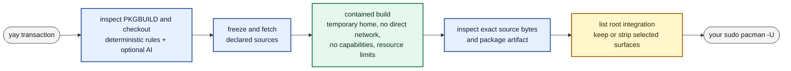

# Prolewatch

<p align="center">
  
</p>

<p align="center">
  <strong>Contain the build. See what the package intends to run as root.</strong>
</p>

<p align="center">
  <a href="https://github.com/holgerjh/prolewatch/actions/workflows/ci.yml"></a>
  <a href="go.mod"></a>
  
  
  <a href="LICENSE"></a>
</p>

Installing from the AUR runs a stranger's code on your machine twice. First
`makepkg` builds the package, and that build runs as you, with access to
everything you can reach. Then `pacman` installs the result as root.

Prolewatch puts the build somewhere it can do less harm: no access to your home
directory, no network unless you allow it. Then, before the install, it shows
you the parts of the finished package that would run with root privileges —
install scripts, pacman hooks, systemd units — and lets you strip them out.

It hooks into `yay` rather than replacing it: `yay` still resolves the
transaction, `makepkg` still builds the package, and final installation remains
your own `sudo pacman -U`. Prolewatch installs no daemon, socket, service,
service account, `sudoers` entry, or setuid binary.

> [!WARNING]
> Prolewatch is experimental, has not received an independent security audit,
> and does not certify AUR packages as safe. It was written with AI assistance
> and its maintainer has not yet read all of it line by line — see
> [How this was built](#how-this-was-built). Its AI prompts, model calibration,
> confidence thresholds, and evaluation coverage are still evolving. Start on
> an isolated Arch Linux system before relying on it.

## See it in action

### Contained yay walkthrough

Prolewatch reviews the recipe, pauses before network contact, and keeps source
acquisition and `makepkg` inside the contained transaction. It ends where its
job ends: at `pacman` asking for your password, because the install itself stays
yours.

<p align="center">
  <a href="docs/images/prolewatch-basic.gif"></a>
</p>

<p align="center"><em>Basic guarded transaction · <a href="docs/demos/prolewatch-basic.cast">sanitized asciicast source</a></em></p>

### Detection, inspection, and AI guidance

AI review is optional and off by default; this is what it adds when you turn it
on. The `moon-buggy` recipe contains several `eval` statements. Prolewatch
detects them without a provider, requires a decision, opens the verified
read-only inspection, and places bounded AI guidance beside each exact finding —
which can raise a question, but never clears the deterministic finding.

<p align="center">
  <a href="docs/images/prolewatch-ai-guidance.gif"></a>
</p>

<p align="center"><em>Detection and contextual guidance · <a href="docs/demos/prolewatch-ai-guidance.cast">sanitized asciicast source</a></em></p>

## What Prolewatch offers

| Control | What it does |
| --- | --- |
| **Build containment** | Runs package-controlled code in a user namespace with a temporary home, enumerated `/etc`, read-only `/usr`, no capabilities, private process and network namespaces, and resource limits. Your SSH keys, GnuPG directory, browser profiles, cloud credentials, shell startup files, and host identity files are not mounted. |
| **Trusted-side source acquisition** | Evaluates the `PKGBUILD` inside containment, freezes its declared source set, and fetches those sources before the package shell runs. A recipe that computes different URLs later fails closed. Direct egress remains unavailable; the first requested public HTTP(S) destination in each makepkg phase pauses the build for a terminal decision. A later phase receives a fresh broker and asks again. |
| **Deterministic inspection** | Inventories the AUR checkout, arrived sources, and final package. Recognised behavior is reported at full severity. In a fully validated unified diff, removed hunk lines are not treated as behavior the patch introduces or preserves; malformed, ambiguous, and oversized diffs keep the conservative raw scan. Structurally decidable failures such as archive traversal, escaping symlinks, special files, and content-binding failures stop outright. Within one live yay transaction, an exact deterministic finding that you approved at the recipe gate is shown but not asked about again when its complete file-manifest entry is unchanged. New findings still stop normally. |
| **Optional contextual AI review** | Adds cross-file context from a bounded snapshot after deterministic inspection. When AI mode is enabled, sources and built artifacts are reviewed normally, while a recipe that produces an approval-eligible finding at the configured decision threshold (`HIGH` by default) automatically receives a guidance pass even when routine recipe review is off. The built-in read-only inspection shows each such finding beside a short, clearly separated AI comment. Guidance is bound to the displayed occurrence by an exact quoted anchor; a mismatched comment is discarded. AI can require a decision but can never clear a deterministic finding. It receives no package-tree mount, and provider failure does not block an install. This is contextual review, not runtime monitoring. |
| **Privileged-integration gate** | Enumerates known root-relevant surfaces, including install scriptlets, `libalpm` hooks, systemd units and generators, `sysusers.d`, `tmpfiles.d`, udev, PAM, polkit, D-Bus policy, and `sudoers` drop-ins. It shows automatic or privilege-granting code before installation and can strip selected surfaces from the archive. Passive surfaces are listed without prompting. |

Containment does not need to recognise malicious code to restrict what the
build can reach. Inspection complements that boundary by describing package
behavior and identifying the privileged integration that a build sandbox
cannot control.

### Why not just run `yay` as a separate user

A dedicated build account is the usual answer to keeping AUR builds away from
your home, and it is a real improvement: package code no longer runs with your
SSH keys, GnuPG directory, and browser profiles in reach. It is the honest
baseline to measure against, so here is what a build still gets once it is on
the other side of that account.

| | `yay` as a separate user | Prolewatch |
| --- | --- | --- |
| **Home the build writes to** | The account's own home, persistent between builds — somewhere package code can settle in and wait for the next one | A temporary home discarded with the build, with no host identity files mounted |
| **Network while package code runs** | Unrestricted | Declared sources fetched on the trusted side before the package's shell runs; a later connection pauses the build for a decision |
| **Resources** | Unrestricted | Memory, CPU, task, runtime, file-size, and whole-process-tree limits |
| **What it costs you** | Your AUR workflow moves into that account, and the built package has to come back out | `yay` stays where it is |

Neither one protects you after installation. Once you run `pacman -U`, the
package is installed and Prolewatch is not watching it.

## Installation

> [!IMPORTANT]
> **Experimental release, not on the AUR.** You install Prolewatch by building
> it from a checkout. Nothing here vouches for that checkout on your behalf:
> there is no published maintainer signature for this release, so reviewing the
> source — or confining it to a disposable Arch system — is the trust decision.
> The signed-release path (maintainer key, signed source archive, AUR recipe
> pinning it in `validpgpkeys`) is implemented and tested but deliberately
> unpublished until a signed release; see [SECURITY.md](SECURITY.md).

Prolewatch installs four unprivileged binaries and its policy file. It installs
no privileged component: no daemon, socket, service, service account, `sudoers`
entry, or setuid binary.

### 1. Build and install the package

The build produces an ordinary Arch package, which you sign with a key you
generate yourself. That signature authenticates *your own build artifact* to
`pacman`; it does not establish trust in the source it was built from.

Run as the normal `yay` user, from an interactive shell:

```bash
make dev-install
```

That is the whole of this section in one step: it creates the signing key if
there is not one, trusts it in the pacman keyring, builds and signs the
package, verifies it against the installed-file allow-list, and installs it.
Re-running reuses the existing key, so it is also how you rebuild after a
change. It will not edit `/etc/pacman.conf` on its own; if `LocalFileSigLevel`
does not require trusted signatures it says so and stops, before spending a
build. Add `PROLEWATCH_SET_PACMAN_SIGLEVEL=1` to let it make that one change,
keeping the original beside it as `/etc/pacman.conf.prolewatch-bak`.

The rest of this section is what that script does, for anyone who would rather
run it by hand — reasonable for a security tool, and worth reading once either
way.

Create and trust the signing key once; `tty` must print a device path, not
`not a tty`. `pinentry-tty` rather than `pinentry-curses`: the curses dialog
needs a minimum terminal size and fails with "Screen or window too small" on a
small window or a serial console.

```bash
dev_key_dir="${XDG_DATA_HOME:-$HOME/.local/share}/prolewatch/dev-signing-gnupg"
install -d -m 0700 "$dev_key_dir"
printf '%s\n' 'pinentry-program /usr/bin/pinentry-tty' \
  > "$dev_key_dir/gpg-agent.conf"
chmod 0600 "$dev_key_dir/gpg-agent.conf"
export GPG_TTY="$(tty)"
gpgconf --homedir "$dev_key_dir" --kill gpg-agent
gpg --homedir "$dev_key_dir" \
  --quick-generate-key "Prolewatch local development package" ed25519 sign 1y
fingerprint="$(gpg --homedir "$dev_key_dir" --with-colons --list-secret-keys \
  | awk -F: '/^fpr:/{print $10; exit}')"
printf '%s\n' "$fingerprint" > "$dev_key_dir/fingerprint"
gpg --homedir "$dev_key_dir" --armor --export "$fingerprint" \
  > "$dev_key_dir/public-key.asc"
sudo pacman-key --add "$dev_key_dir/public-key.asc"
sudo pacman-key --lsign-key "$fingerprint"
```

The package verifier requires `LocalFileSigLevel = Required TrustedOnly` in
`/etc/pacman.conf`. This is stricter than the Arch default: stock
`LocalFileSigLevel = Optional` installs an unsigned local package without
complaint, so requiring a trusted signature is what makes the signature above
mean anything. It applies to every later `pacman -U` on the system, which is
why nothing changes it for you unless asked. Then build, verify, and install:

```bash
make release-check
make arch-package
make verify-arch-package PACKAGE=/absolute/path/to/prolewatch-dev-VERSION-x86_64.pkg.tar.zst
sudo pacman -U -- /absolute/path/to/prolewatch-dev-VERSION-x86_64.pkg.tar.zst
```

Use the exact `prolewatch-dev-*.pkg.tar.zst` path printed by `make arch-package`.
`verify-arch-package` checks the built package against an allow-list of
installed files. Installation modifies neither the pacman keyring nor
`LocalFileSigLevel`. The package provides `prolewatch` and will conflict cleanly
with a future release package.

Prolewatch's own build is not protected by Prolewatch. It is installed before
any of its controls exist, and for this release no maintainer signature covers
that first build either; containment begins with the next AUR transaction.

### 2. Check the session prerequisites

Contained evaluation and builds run as transient `systemd --user` units. This
user manager is a security prerequisite: it enforces the memory, CPU, task,
runtime, file-size, and whole-process-tree kill limits around package-authored
code. Run `prolewatch setup` and later `yay` commands from a normal TTY, desktop,
or SSH login created through PAM, then verify the current session:

```bash
printf 'XDG_RUNTIME_DIR=%s\n' "${XDG_RUNTIME_DIR:-<unset>}"
systemctl --user show --property=Version
prolewatch doctor --no-probe
```

Do not fix an absent manager by merely exporting `XDG_RUNTIME_DIR`; the runtime
directory and its user bus must belong to a running manager. For a dedicated or
headless account that cannot keep a login session, enable lingering explicitly:

```bash
account=$(id -un)
uid=$(id -u)
sudo loginctl enable-linger "$account"
sudo systemctl start "user@${uid}.service"
```

Leave the current shell and start a fresh direct TTY or SSH login before running
`doctor` again; `su` and `sudo -iu` may not create the required PAM session
environment even when lingering is enabled. If a direct login is unavailable,
first confirm that the lingering manager has created a runtime directory and
user bus, then reconnect the current shell to that existing manager:

```bash
uid=$(id -u)
runtime_dir="/run/user/${uid}"

if ! test -O "$runtime_dir" ||
   ! test -S "$runtime_dir/bus" ||
   ! test -O "$runtime_dir/bus"; then
  echo "No live user manager owned by uid ${uid} at ${runtime_dir}" >&2
  exit 1
fi

export XDG_RUNTIME_DIR="$runtime_dir"
export DBUS_SESSION_BUS_ADDRESS="unix:path=${runtime_dir}/bus"

systemctl --user show --property=Version
prolewatch doctor --no-probe
```

Run `yay` from this same shell after `doctor` succeeds. These exports only tell
the client how to reach an already running, same-user manager; they do not start
one or make an unowned runtime directory safe. Do not skip the ownership and
socket checks.

Lingering starts the user manager at boot and keeps it, its runtime directory,
user services, and timers available after logout. It grants no root privilege,
but it lets anything that already runs as that account maintain user-level
persistence and consume resources without an active session. Prefer a normal
login for an everyday account; reserve lingering for a dedicated/headless
account. Disable it when it is no longer needed:

```bash
sudo loginctl disable-linger "$(id -un)"
```

### 3. Hook it into yay

```bash
prolewatch setup
```

`prolewatch setup` checks the installed files and sandbox before changing
`yay`, then installs and verifies the hook. It changes only `makepkg_bin` and
`gpg_bin`; existing clean, diff, edit, and redownload preferences remain
untouched. Its required resource-envelope probe starts the same kind of
transient systemd user unit used by a real build, so setup fails before changing
`yay` when the current session cannot enforce those limits. Configuration lives
at `/etc/prolewatch/config.json` as a pacman backup file. `prolewatch install-hook`
is available when only the lower-level hook step is wanted.

### If Prolewatch stops a package you want

Most stops have a way through that keeps containment on. Reach for the narrowest
one that fits.

| What you saw | Way through | Build stays contained |
| --- | --- | --- |
| `NEEDS YOUR DECISION` | `prolewatch approve <report id>`, then run the same `yay` command again. The token is one-time and bound to that exact content and policy. | Yes |
| A privileged-integration prompt | `k` keeps every listed surface. Numbers strip only the ones you name. | Yes |
| `BUILD STOPPED` | Raise the matching `build.*` value in `/etc/prolewatch/config.json`, then build again. | Yes |
| `BUILD FAILED` | A packaging defect, not a verdict. Report it to the AUR maintainer, or repair the recipe with `yay -S <package> --editmenu`. | Yes |
| `SANDBOX ERROR` | Containment could not be established. `prolewatch doctor` checks the prerequisites. | — |
| `STRUCTURAL FAILURE` | Nothing. No approval crosses it. The output names what to inspect, rebuild, or report. | — |

There is no global override, and there is no setting that turns enforcement off
for everything. Configurations carrying the retired `overrides.allow_unsafe`
key are rejected.

#### Building one package without Prolewatch

If you want a specific package that Prolewatch will not build for you, build
that one package without `yay`:

```bash
git clone https://aur.archlinux.org/<package>.git
cd <package>
# Read the PKGBUILD and any .install file before running this.
makepkg -si
```

Prolewatch only redirects `yay`. It installs no pacman hook and does not replace
`/usr/bin/makepkg`, so a manual build runs with **no containment, inspection,
network prompt, or integration gate**: the package's build code runs as your
user, with your `$HOME`, your SSH and GnuPG keys, and your network.

Know this route precisely because it is the narrow one. It costs one package and
one deliberate act, and every later `yay` build stays contained. Removing the
hook, below, is the wide one: it costs every future build until you put the hook
back. If you are going to step outside the boundary, step outside it for the one
package you meant to.

### Deliberately remove the yay hook

If a yay or makepkg update produces a command shape this Prolewatch release does
not support, first run `prolewatch doctor` and update or repair Prolewatch. As an
explicit compatibility escape hatch, you can remove only the yay integration:

```bash
prolewatch uninstall-hook
```

This removes Prolewatch's managed block from yay's `init.lua`. The managed
`prolewatch.lua` module is removed only when it still matches the packaged copy;
a modified module and unrelated yay configuration or backups are preserved. It
does not uninstall the Prolewatch package.

After `uninstall-hook`, subsequent yay builds run without Prolewatch containment,
inspection, network prompts, or package review. Do not use it to bypass a
finding or structural failure. Once the compatibility problem is resolved, run
`prolewatch setup` to recheck the security prerequisites and reinstall the hook.

If what you actually want is one package that Prolewatch will not build, build
that package without `yay` instead, as described above. That leaves containment
in place for everything else.

The sandbox needs subordinate UID and GID ranges. Existing accounts do not
always have them. Only if `setup` or `doctor` reports them missing, let the
system account tools allocate unused ranges:

```bash
sudo usermod --add-subids -- "$(id -un)"
prolewatch doctor
```

Do not choose a numeric range yourself: overlaps let accounts map the same host
IDs, and computing a free range before invoking `sudo` creates a race.
`usermod` allocates under the system policy while managing the subordinate-ID
databases. This delegation permits mappings inside user namespaces; it does not
grant host root or capabilities. Prolewatch validates the allocation and
`doctor` exercises the real namespace before setup continues.

## How it works



1. **Inspect and freeze.** Prolewatch evaluates the `PKGBUILD` inside
   containment, inventories the checkout, applies deterministic rules, and
   optionally requests contextual AI review. The declared source set is then
   fixed so package code cannot widen it later.
2. **Acquire and bind.** Prolewatch fetches declared HTTP(S) sources on the
   trusted side, records provenance and verification, and binds decisions to
   the arrived bytes. Vendor content is not semantically scanned by default
   (`vendor.scan_depth: 0`); depth `1` scans direct vendor content, depth `2`
   opens one nested archive, and so on. The checkout and final artifact are
   always scanned. If an approved recipe finding appears unchanged in this
   fuller scan, the report marks its exact bytes as previously approved instead
   of asking the same question twice. The complete finding remains visible.
3. **Build with restricted access.** Package phases run as the normal user in
   containment. A mid-build network request can reach only the broker; a public
   destination needs an answer from your terminal, separated from package
   output. Cargo and Go detection adds context but never grants access
   automatically.
4. **Inspect before root handoff.** Prolewatch checks the `.pkg.tar.zst`, lists
   every known root-integration surface, and asks about surfaces that run
   automatically or grant privilege. At that gate you may keep everything or
   strip selected members before `yay` hands the archive to `pacman`. A package
   with only passive integration is listed without a prompt or strip choice.

Deterministic inspection runs in both `deterministic-only` and `ai` modes; the
latter adds the bounded contextual review above. The mode is part of the policy
fingerprint, so changing it invalidates earlier decisions. Neither mode judges
a package safe.

| Outcome | Meaning |
| --- | --- |
| `NO BLOCKING FINDINGS` | No finding needs a decision. |
| `NO NEW DECISION NEEDED` | The report contains a severe deterministic finding already approved at the recipe gate; its full file-manifest entry is unchanged in this live transaction, and no new evidence needs an answer. |
| `NEEDS YOUR DECISION` | A severe finding requires review and may be approved. |
| `STRUCTURAL FAILURE - NOT APPROVABLE` | A structural failure stopped the transaction; no approval can cross it. |
| `APPROVED BY YOU` | You approved this exact snapshot once. |

A build that never reaches a verdict is labelled separately, because a broken
recipe and a hostile package are not the same event and should not look alike:

| Outcome | Meaning |
| --- | --- |
| `BUILD FAILED` | The contained build exited non-zero. Usually a defect in the recipe or its upstream — Prolewatch cannot tell you it was the package's own build that failed, only that the contained command exited non-zero. |
| `BUILD STOPPED` | Prolewatch's resource envelope ended the build: the runtime timeout, the output ceiling (`build.output_bytes`), the workspace ceiling (`build.workspace_bytes`), a kill, or cancellation. Containment worked as configured. Adjust the matching `build.*` limit if the package legitimately needs more. |
| `SANDBOX ERROR` | Containment could not be established. This one is about Prolewatch or the host, not the package. |

When a build fails, contained `makepkg` output is replayed in the order
Prolewatch observed it rather than as one block per stream, so the failure reads
in the order it happened instead of with every error hoisted above the step that
caused it. Successful phases still print each stream separately. The order is
what the capture goroutines observed across two pipes, which is exact enough to
read a build by and is not a promise about the child's own interleaving.

Approvals are one-time and bound to the exact content and policy shown. Network
grants are bound to the transaction and displayed destination. There is no
global override: configurations containing the retired
`overrides.allow_unsafe` setting are rejected.

### If you turn on AI review

AI review is off by default. `review.mode` is `deterministic-only`, so a stock
installation contacts no provider, sends nothing anywhere, and reaches every
decision locally. Nothing below applies until you change that.

Setting `review.mode` to `ai` adds a contextual pass on top of deterministic
inspection. It runs through a supported provider CLI and account that you
configure explicitly, so it uses your own provider quota, and it is bounded by
`review.timeout_seconds` (180s) per batch.

#### Enable Codex review

This integration does not run Codex Security's `scan` command. Prolewatch first
performs its own deterministic package inspection, then invokes `codex exec`
with a fixed prompt and structured-output schema for each bounded review batch.

Prolewatch requires Codex CLI `>=0.146.1`, and the adapter has been checked
against releases below `0.150.0`. The floor is a refusal: below it the flags
this adapter passes do not exist. The ceiling is only a warning — a newer Codex
still runs, and `prolewatch doctor` says plainly that its invocation flags are
unverified — because every way a newer CLI could actually break the adapter
already fails closed, and refusing to run the day Arch ships a new Codex would
cost more than it buys.

Prolewatch runs `/usr/bin/codex` specifically. That path is
not searched for on `PATH`, so a Codex installed under `~/.local/bin` or
`/usr/local/bin` is not the one Prolewatch will use. Check the exact path and
its version:

```bash
ls -l /usr/bin/codex
/usr/bin/codex --version
```

`prolewatch doctor` reports a missing binary or an unsupported version too.

Prolewatch intentionally does not reuse the ordinary `~/.codex` login. Give it
a dedicated, file-backed Codex home under the invoking user's Prolewatch state
directory and authenticate there:

```bash
prolewatch_codex_home="${XDG_STATE_HOME:-$HOME/.local/state}/prolewatch/providers/codex"
install -d -m 0700 "$prolewatch_codex_home"

CODEX_HOME="$prolewatch_codex_home" \
  /usr/bin/codex --config 'cli_auth_credentials_store="file"' login

# Only after login has actually written the file:
chmod 0600 "$prolewatch_codex_home/auth.json"
CODEX_HOME="$prolewatch_codex_home" /usr/bin/codex login status
```

The plain `login` command opens the ChatGPT browser flow. On a headless machine,
use `login --device-auth`; API-key users can instead pipe the key to
`login --with-api-key`. Treat `auth.json` like a password. Prolewatch checks
that it is a regular file owned by the invoking user with no group or other
access, and mounts only this dedicated directory read-write so Codex can refresh
its tokens.

Next, edit `/etc/prolewatch/config.json`: keep `provider` set to `codex` and
change `review.mode` from `deterministic-only` to `ai`. Then validate the file
and establish the provider attestation:

```bash
sudoedit /etc/prolewatch/config.json
prolewatch config-check
prolewatch doctor
```

The first `doctor` after enabling AI must run without `--no-probe`. It makes a
real provider request and establishes three things: that Codex starts with an
empty workspace, that it cannot read a sentinel placed in host `/tmp`, and that
it recognises a prompt-injection canary. Only checks the run actually observed
are written down.

The resulting attestation is bound to the provider binary, the AI policy, and
the archive probe, so renew it with `prolewatch doctor` after changing any of
them. The archive probe is `bsdtar`, which means an ordinary `libarchive`
upgrade also invalidates the attestation and asks for a fresh probe.

If setup has not installed the yay hook yet, run `prolewatch setup` after this
live probe: `setup` deliberately spends no provider request, so it validates the
stored attestation rather than creating one, and refuses to install the hook
while that attestation is missing.

During a package review, Codex receives the manifest, source-verification
status, deterministic findings, selected text, and a bounded context window for
each guidance target - not a mount of the package tree or the rest of the user's
home. It must quote the target's exact anchor back; guidance attached to a
different occurrence is discarded. It runs ephemerally in a separate
Bubblewrap sandbox with an empty workspace, no web search, ignored user and
project rules, disabled feature surfaces, no approval prompts, and a read-only
Codex sandbox. AI can require a decision but cannot clear deterministic
findings; provider failure falls back to the deterministic result.

| Provider | Default model | Effort | Model identity |
| --- | --- | --- | --- |
| `codex` (default) | `gpt-5.6-sol` | `high` | Pinned identifier |
| `anthropic` | `sonnet` | `high` | **Moving alias** |

#### Where AI review is spent

Prolewatch inspects a package at three points, and AI review is aimed at the
two that carry the most for it to read:

| Gate | What it holds | AI review |
| --- | --- | --- |
| **recipe** — before any source is fetched | The `PKGBUILD` and `.SRCINFO`. Usually two small, highly structured files. | On for deterministic findings at the manual-review threshold; otherwise optional |
| **sources** — before the build runs | The fetched upstream code. The largest and least structured input in the transaction. | Always |
| **built package** — before `pacman` installs it | What the build produced, including everything that would run as root. | Always |

The recipe gate is normally conditional, and not because it is unguarded:
deterministic inspection runs at all three gates regardless, and it is
strongest exactly where recipes are concerned, because its rules are written
for `PKGBUILD` shapes. When that pass reaches the configured manual-review
threshold (`HIGH` by default), AI mode asks the provider for guidance while preserving the deterministic
decision. This spends the extra call where cross-file context can help explain
an ambiguous `eval`, generated patch, or integration surface without letting
the model clear it. At the default decision prompt, `[i] Inspect HIGH/CRITICAL findings`
shows only decision-requiring items, with SHA-256-bound source context where a
local text line is available. Provider guidance is visually separated and
labelled as advisory AI text, never as package source. If the threshold is
`medium`, the action becomes `Inspect MEDIUM+ findings` and the same threshold
drives policy, inspection, and guidance selection. The inspector also names the
exact local file and line for deeper manual reading, but deliberately does not
launch an editor: external editor plugins, modelines, and project configuration
are outside Prolewatch's verified read-only display boundary. A conditional
recipe run reports `completed · triggered by findings`, so it cannot be
mistaken for routine all-recipe review.

Clean recipes remain skipped by default. Reviewing every recipe in a
transaction that pulls ten dependencies would add a third of the waiting and a
third of the quota, spent on the input with the least for a model to say.

Turn it on when you want a recipe read before you spend bandwidth on its
sources:

```json
"review": { "include_recipe_phase": true }
```

To keep recipe review fully opt-in even for decision-requiring deterministic findings, set
`"guide_decision_findings": false`. This changes provider use only; it does
not remove or downgrade deterministic findings.

The manual-decision threshold is separately configurable:

```json
"review": { "manual_review_minimum_severity": "medium" }
```

Lowering it is stricter; raising it is more permissive. Structural hard stops
remain non-approvable at every setting, and changing the threshold changes the
policy fingerprint, so an approval cannot cross between policies.

Reports say which applies, so a skipped gate is never something you have to
infer:

```text
AI review
  • not run · recipe has no findings at the HIGH decision threshold · set review.include_recipe_phase to review every recipe
```

#### Cost and effort

Both defaults select `high` effort, which is the slow, expensive end of the
range. That is deliberate: a review worth blocking an install on is worth
thinking about, and review runs once per eligible gate rather than
continuously. A phase is split into one or more review batches, each of which
invokes the provider under its own `review.timeout_seconds`, so the cost is
seconds to minutes on a build rather than milliseconds. Lower `effort` in
`/etc/prolewatch/config.json` if you would rather have speed, and expect
weaker findings for it.

The Anthropic default is a **moving alias**, and this has a consequence worth
understanding before you rely on it. `sonnet` resolves to whichever model the
provider currently points it at. Prolewatch records the string it was
configured with, so a report says `sonnet` rather than naming the model that
actually answered, and two reports carrying the same policy fingerprint can
have been produced by different models weeks apart. Pin a full model
identifier in `providers.anthropic.model` if you need a report to mean one
fixed thing over time. The `codex` default is already a pinned identifier and
does not have this property.

None of this weakens deterministic enforcement. AI review can turn an allow
into a decision, but it can never clear a deterministic finding, and a provider
that fails, times out, or is not installed leaves a deterministic briefing and
an install that proceeds on deterministic grounds alone. The quality of a model
you select is therefore a question of how much extra context you get, never of
what the tool will let past.

## How this was built

Prolewatch was written with AI assistance: the implementation, the tests, and
most of this documentation. That belongs on the front page rather than left for
someone to infer from the commit history.

**What was done.** The design went through many iterations, including one that
discarded an entire privileged architecture — a root service with a sealed
handoff — after a review found it had traded a validated capability for an
unvalidated one. Two frontier models, Opus 5 and gpt-5.6-sol, were used
adversarially against the code and the threat model, and their findings drove
what the design is now. Every commit passes a release gate: race-enabled tests,
`govulncheck`, an import-direction layering check, a privileged-asset
invariant, nine deterministic security scenarios, and a coverage floor. The
isolation claims are measured on a real kernel by the probes in
`scripts/probes/`.

**What was not done.** There has been no independent security audit, and the
maintainer has not yet read the whole codebase line by line. Model-assisted
review is not a human who understands every path, and no amount of it adds up
to one.

**Why that is a reasonable trade at this stage.** What Prolewatch enforces
rests on the kernel and systemd, set up by a small amount of code: a user
namespace, a Bubblewrap sandbox, and a transient systemd unit. A defect in the
scanner yields a wrong description of a package; it does not remove the sandbox
around the build. Prolewatch also installs no daemon, socket, service account,
`sudoers` entry, or setuid binary, so a defect is bounded by what a process
running as you could already do. The part that most deserves a careful human
reading is therefore small and known: the containment setup, the `makepkg`
wrapper, and the privileged-integration gate.

If you would rather check it than take that on trust,
[Reviewing Prolewatch](docs/reviewing-prolewatch.md) names the files that carry
the weight — about a fifth of the code — and the checks you can run yourself.

**Before a signed release**, the maintainer will read that trust boundary —
containment setup, wrapper, gate, and integration enumeration — line by line.
If you want a component you trust rather than one you are evaluating, that is
the release to wait for. Until then the badge is the honest summary:
experimental, and best met on a disposable Arch system.

## What it does not guarantee

Prolewatch reduces the reach of untrusted build code and makes known
root-integration surfaces visible. It is not a malware verdict, a virtual
machine, or a general trust service.

- **The host remains part of the boundary.** Bubblewrap shares the host kernel.
  Prolewatch trusts the kernel, systemd, Bubblewrap, the local toolchain,
  `yay`, `makepkg`, `pacman`, sudo policy, and signed Arch repositories. Sandbox
  defects, kernel compromise, and denial of service remain possible.
- **Inspection is fallible.** Deterministic and AI review can miss malicious
  behavior or flag benign behavior. Prolewatch does not establish maintainer,
  source-host, signing-key, or upstream trust, and it says nothing about the
  safety of a program after installation.
- **The integration registry is maintained, not exhaustive.** Software already
  on the host can define another root-executed directory. A mechanism outside
  the registry is outside the enumeration guarantee. Host `pacman` still
  installs the package with package-management privileges.
- **Interception is user-owned.** Code that has already run as the user can
  remove the `yay` hook, after which later AUR builds run without Prolewatch.
  The bootstrap installation is also unprotected, as described above.
- **Resource limits are bounds, not complete isolation.** Workspace byte and
  file limits are monitored rather than filesystem quotas. While `makepkg`
  makes `pkg/` execute-only, growth below it cannot be counted; the filesystem
  free-space reserve is the backstop.
- **Supported inputs are deliberately narrow.** Package artifacts must use
  Arch's default `.pkg.tar.zst` format. Declared sources must be fetchable over
  HTTP(S); `git://` and `git+ssh://` sources are rejected rather than receiving
  broader network or credentials.
- **Some transactions require a terminal.** If a surface runs as root
  automatically or grants privilege, an unattended install stops. Passive-only
  integration is listed without a question. Blocked or failed archives are
  retained at `~/.local/state/prolewatch/quarantine/<report id>/`; Prolewatch
  prints the path but does not yet provide a list or prune command. Contained
  `makepkg` build output is retained as a terminal-safe private log at
  `~/.local/state/prolewatch/reports/<report id>.makepkg-build.log` (or beneath
  `$XDG_STATE_HOME`) and is pruned with its report history.
- **Archive inspection and archive extraction use different parsers.**
  Prolewatch inventories the finished `.pkg.tar.zst` with its own Go reader,
  while `pacman` extracts it with libarchive. The two have not been compared
  against a differential corpus, so a name, link, duplicate entry, or metadata
  case both accept but interpret differently would be inspected as one thing and
  extracted as another. The gate's enumeration is therefore an accurate account
  of what Prolewatch's reader saw, not a proof that libarchive will see the
  same.
- **Field coverage is not yet representative.** Compatibility and prompt rates
  have not been measured across a representative sample of compiled, `-bin`,
  VCS, split, Cargo, Go, npm, and scriptlet-carrying AUR packages. The synthetic
  corpus demonstrates only the cases it contains.

If package-controlled code may already have executed, a later clean report is
not evidence that the host is clean. Follow the relevant incident guidance and
perform normal incident response. The complete trust boundary, control design,
and measured properties are in the [architecture document](docs/architecture.md).

## Documentation and evidence

The repository contains harmless synthetic security scenarios. `make
scenarios` passes them through the production deterministic scanner and policy
without executing a `PKGBUILD`, install script, downloaded command, native
fixture, or archive member:

```bash
make scenarios
```

A `PASS` means that a fixture's declared decision, approval eligibility,
findings, and coverage state matched. It does not mean every variation of the
technique is detected. The complete table and claim boundaries are in the
[scenario methodology](docs/security-scenarios.md).

After installing the same version as the checkout and completing setup, the
normal `yay` user can run `make installed-scenarios`. It checks the installed
version and hook health, then evaluates the deterministic corpus through the
installed binary. It does not execute fixture content, contact an AI provider,
write reports or markers, or change the package database.

| I want to… | Read |
| --- | --- |
| Understand the design, trust boundary, and implementation details | [Architecture](docs/architecture.md) |
| Check the code yourself | [Reviewing Prolewatch](docs/reviewing-prolewatch.md) |
| See how isolation claims are measured on a real kernel | [Probes](scripts/probes/README.md) |
| Inspect the acceptance corpus and exact scenario claims | [Reproducible security scenarios](docs/security-scenarios.md) |
| Review incident sources, mitigation labels, and residual risk | [AUR threat model and incident map](docs/aur-threat-model.md) |
| Report a vulnerability | [Security policy](SECURITY.md) |
| Contribute or disclose AI-assisted work | [Contributing](CONTRIBUTING.md) |

## Project information

`0.11.0` is the first public release. There are no earlier public versions: the
number is where development arrived, not the eleventh release. There is no
changelog yet for the same reason.

Run the full local release gate with `make release-check`. It checks modules,
vulnerabilities, race behavior, vet, shell scripts, public security scenarios,
and security-code coverage, then builds deterministic Linux binaries and
CycloneDX SBOMs. CI runs the same gate.

Prolewatch is licensed under
[GNU AGPL version 3 only](LICENSE) (`AGPL-3.0-only`). Commercial use is allowed
under its terms. Third-party notices are collected in
[`THIRD_PARTY_NOTICES`](THIRD_PARTY_NOTICES). External code contributions are
paused while the licensing arrangement for outside patches is settled; issues,
security reports, and design feedback remain welcome. See
[CONTRIBUTING.md](CONTRIBUTING.md).

The name refers to the proles in George Orwell's *1984*: here, the watch belongs
to the users and maintainers who keep Linux and the AUR working, and it is
pointed at the package. Prolewatch is human-directed and human-maintained;
generative AI assistants have been used for implementation, debugging,
documentation, and review, while maintainers decide what is accepted.

Copyright (C) 2026 Holger Heinz.
