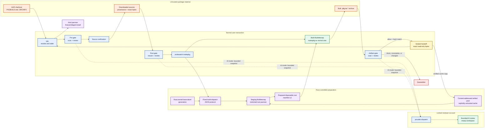
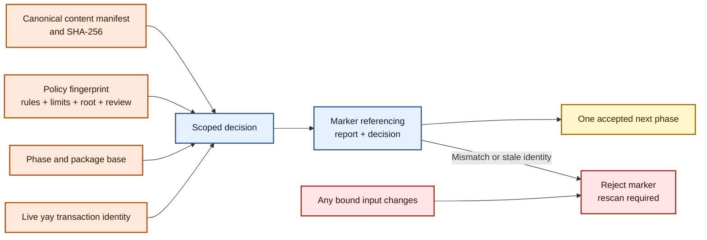
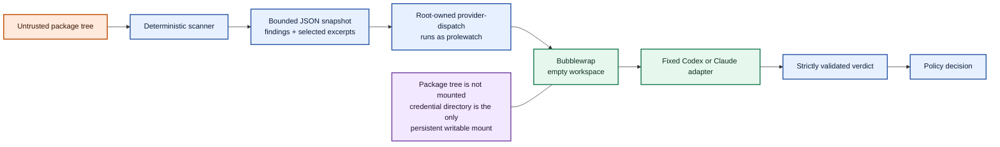
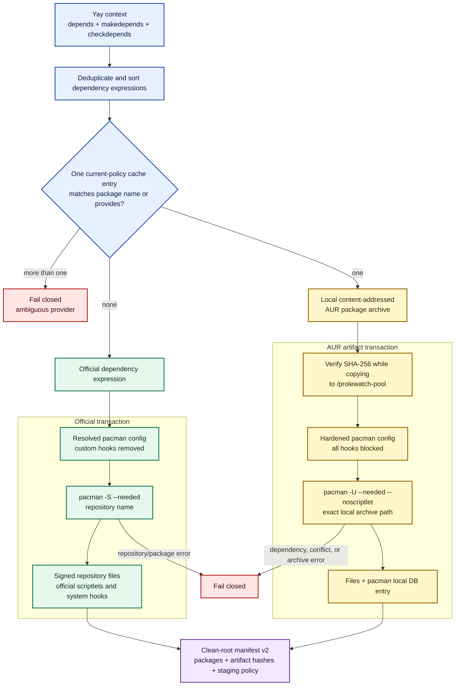
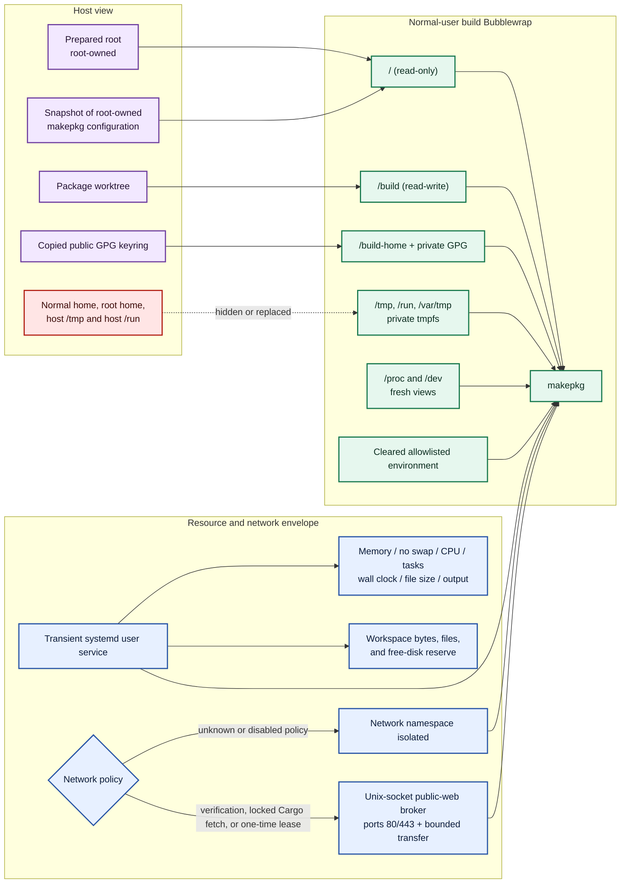
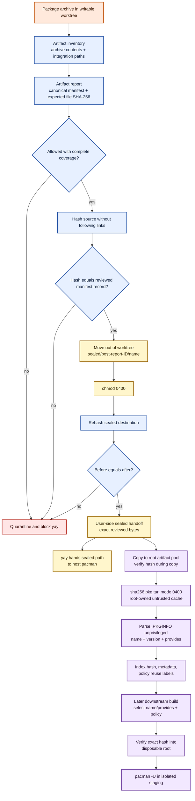
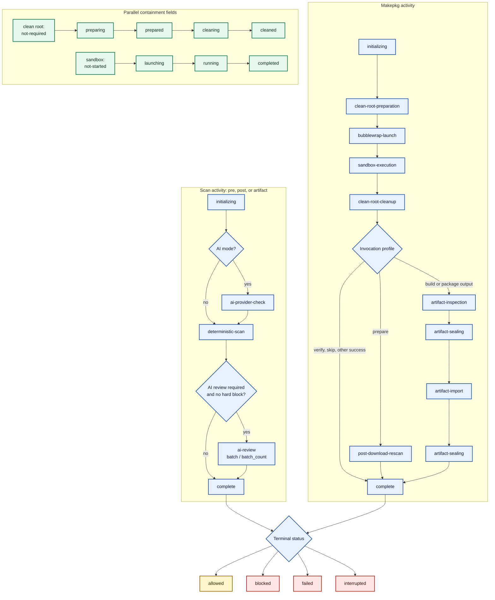

# Prolewatch technical architecture

Prolewatch is an experimental security boundary around AUR builds driven by
`yay`. It does not replace `yay`, `makepkg`, or `pacman`, and it does not turn an
AUR package into trusted software. It adds content-bound inspection gates,
disposable build userspaces, constrained execution, and an inspected handoff
between those existing tools.

This document explains the design from two angles:

- **conceptually:** why each boundary exists and which component owns each
  decision; and
- **technically:** which processes run, with which privileges, mounts, network
  policy, manifests, and package-manager semantics.

> [!WARNING]
> Prolewatch is under active development and has not received an independent
> security audit. Bubblewrap shares the host kernel, AI review is heuristic,
> and the final package installation still runs through the host package
> manager with package-management privileges.

## Trust boundary and mental model

An AUR package is not just an archive of passive files. Its `PKGBUILD` is shell
code interpreted by `makepkg`; downloaded sources can contain more executable
material; build phases can run arbitrary commands; and the resulting package
can contain install scriptlets, ALPM hooks, services, or other privileged
integration files.

Prolewatch therefore does not make one reusable "this package is safe"
decision. It protects transitions between representations:

1. AUR recipe and repository files are inspected before source processing.
2. Downloaded source bytes and their verification are bound again; vendor
   content is semantically inspected only to the configured depth.
3. Package-controlled phases run in a constrained normal-user sandbox.
4. Produced package archives are inspected as new, independently untrusted
   objects.
5. Only the exact inspected bytes are moved into the sealed handoff used by
   `yay` and host `pacman`.

Every gate is bound to both content and active policy. A changed file, provider,
prompt, scanner, clean-root generation, sandbox limit, or other fingerprinted
input invalidates the preceding decision.



The visual vocabulary is consistent throughout this guide:

| Color | Meaning |
| --- | --- |
| Orange | Package-controlled material that remains untrusted |
| Blue | Inspection, policy, or orchestration control |
| Purple | Privileged or root-controlled component |
| Green | Contained execution |
| Yellow | Exact-content handoff |
| Red | Terminal deny or quarantine path |

## Division of responsibility

| Component | Owns | Does not own |
| --- | --- | --- |
| `yay` | Transaction resolution, dependency ordering, AUR checkout, supported `makepkg` calls, final archive handoff to pacman | Inspection policy or sandbox enforcement |
| Prolewatch hook | Bounded transaction context and the pre/post scan gates | Dependency resolution |
| Deterministic scanner | Complete bounded inventory, canonical manifest, structural rules, archive and binary inspection | Execution of `PKGBUILD` |
| AI reviewer | A second heuristic review of a bounded snapshot | A proof of safety or an override for hard blocks |
| `prolewatch-makepkg` | Invocation allowlist, marker verification, clean-root request, build sandbox, artifact gate and sealing | `PKGBUILD` semantics |
| Root `build-dispatch` | Fixed clean-root lifecycle and isolated package-manager staging | Arbitrary commands, mounts, environments, worktrees, or build phases |
| `makepkg` | Standard source verification and `PKGBUILD` phase semantics | Host containment policy |
| `pacman -S` | Installing named packages from configured signed sync repositories | AUR lookup |
| `pacman -U` | Installing exact local package archive paths and recording them in the local package database | Finding or trusting AUR packages |
| Host `pacman` | Final system transaction for the sealed archive selected by `yay` | Predicting all future behavior of installed files |

The core principle is that dependency **resolution** and dependency
**materialization** are separate operations. `yay` resolves a graph that can
contain both official and AUR packages. The disposable root must then
materialize that graph using two different pacman operations because pacman's
sync databases do not contain AUR packages.

## End-to-end transaction

```mermaid
sequenceDiagram
    autonumber
    actor User
    participant Yay as yay + Lua hook
    participant Gate as Scanner / policy / AI
    participant Wrapper as prolewatch-makepkg
    participant Root as root build-dispatch
    participant Stage as staging Bubblewrap + pacman
    participant Build as build Bubblewrap + makepkg
    participant Seal as artifact gate / sealed store
    participant Host as host pacman

    User->>Yay: yay -S package
    Yay->>Yay: Resolve official + AUR dependency graph
    Yay->>Gate: AURPreInstall(pre, checkout, bounded context)
    Gate->>Gate: Deterministic inventory and canonical manifest
    opt AI review mode and no structural hard block
        Gate->>Gate: Review bounded snapshot as locked account
    end
    Gate-->>Yay: Allow marker or fail closed

    Yay->>Wrapper: Supported source-verification invocation
    Wrapper->>Gate: Verify pre marker, transaction, policy, and current bytes
    Wrapper->>Root: prepare(base generation, policy fingerprint)
    Root->>Stage: Copy base; do not stage transaction dependencies yet
    Stage-->>Root: Prepared-root manifest
    Root-->>Wrapper: Caller-bound root path + token + manifest
    Wrapper->>Build: makepkg verification profile
    Note over Build: Public-Web broker is available for source verification
    Build-->>Wrapper: Verified/downloaded source state
    Wrapper->>Root: cleanup(caller-bound token)

    Yay->>Gate: AURPostDownload(post, checkout + sources)
    Gate-->>Yay: New allow marker or fail closed

    loop Each supported prepare/build/check/package-related invocation
        Yay->>Wrapper: Supported makepkg profile
        Wrapper->>Gate: Verify post marker and rescan current bytes
        Wrapper->>Root: prepare(dependencies, policy fingerprint)
        Root->>Stage: Fresh disposable root from recorded base generation
        Stage-->>Wrapper: Prepared-root manifest
        Wrapper->>Build: makepkg as normal user
        Note over Build: Offline unless a matching one-time lease is consumed
        Build-->>Wrapper: Phase result / package archive
        Wrapper->>Root: cleanup(caller-bound token)
    end

    Wrapper->>Seal: Inspect every produced .pkg.tar.* archive
    alt Allowed and unchanged
        Seal->>Seal: Compare hash, move, chmod 0400, rehash
        Seal->>Root: Import verified copy into untrusted content cache
        Seal-->>Yay: Sealed archive path
        Yay->>Host: Install exact sealed package archive
    else Blocked, incomplete, or changed
        Seal->>Seal: Move artifacts to quarantine
        Seal-->>Yay: Abort transaction
    end
```

### Phase table

| Phase | Principal | Main input | Network | Durable output |
| --- | --- | --- | --- | --- |
| Resolution | Normal user / `yay` | AUR metadata and sync databases | `yay` policy | Ordered transaction context |
| Pre gate | Normal user; reviewer under locked account in AI mode | AUR checkout | Reviewer CLI only in AI mode | Pre report and allow marker |
| Source verification | Normal-user makepkg sandbox; root only while copying the base generation | Pre marker and declared sources | Public-Web broker | Downloaded/verified sources and sandbox evidence |
| Post gate | Normal user; reviewer under locked account in AI mode | Checkout plus bound vendor sources; content only to configured depth | Reviewer CLI only in AI mode | Post report, source provenance, and allow marker |
| Dependency staging | Root in dedicated Bubblewrap | Base generation, dependency names, cached local archives | Only official `pacman -S` transaction | Prepared-root manifest v2 |
| Build phases | Normal user in separate Bubblewrap | Read-only prepared root and writable worktree | Off, automatically brokered for `cargo fetch --locked`, or an exact one-time public-web lease | Package archive in worktree |
| Artifact gate | Normal user; reviewer under locked account in AI mode | Produced `.pkg.tar.*` archives | Reviewer CLI only in AI mode | Artifact report, quarantine, or sealed handoff |
| Final installation | Host package-manager privilege | Exact sealed archive path | Pacman policy | Installed host package |

### Repeated makepkg invocations

`yay` does not necessarily invoke `makepkg` once. The wrapper classifies each
call into a supported profile and prepares a fresh disposable root for that
call. The recognized classes correspond to the supported yay workflow:

| Profile | Recognizing operation | Protected marker | Purpose |
| --- | --- | --- | --- |
| `verify` | `--verifysource` | `pre` | Verify or fetch declared sources |
| `prepare` | `--nobuild` | `post` | Run the accepted preparation path without packaging |
| `skip` | `--nobuild --noextract` | `post` | Supported no-build/no-extract path |
| `packagelist` | `--packagelist` | `post` | Return sealed paths rather than unchecked worktree paths |
| `build` | `--noextract --noprepare --holdver` | `post` | Run the final build/check/package path |

Unknown combinations fail closed. Integrity-bypass options such as
`--skipchecksums` and `--skipinteg` are forbidden. The wrapper snapshots only
root-owned system `makepkg` configuration and uses the dedicated GPG wrapper
for the supported public-key operations.

## Content-bound decisions

A Prolewatch report is not a reusable package reputation flag. Authorization
is scoped to one phase of one live transaction under one policy, and it names
the exact content manifest that was inspected.



### Deterministic inventory

The scanner does not source a `PKGBUILD`. It traverses the tree through
directory file descriptors, uses no-follow opens, and checks file identity
around full reads. Its inventory covers regular files, links, special files,
and, where policy selects content inspection, supported nested archives and
bounded metadata/strings from recognized binary formats. It also checks static
`PKGBUILD`/`.SRCINFO` consistency.

Declared remote sources form a separate policy lane. At the default
`vendor.scan_depth: 0`, Prolewatch reads each source to a SHA-256-bound manifest
record but does not decompress or semantically scan it. It records transport,
the `.SRCINFO` checksum or VCS binding, the observed hash, and the `makepkg`
checksum/PGP result. Weak provenance is a non-blocking warning. Depth `1`
inspects direct vendor content, depth `2` opens one nested vendor archive, and
so on. Makepkg-created entries in the extracted vendor `src/` tree, including
symlink targets, remain exact manifest inputs at depth `0` but are not
interpreted as AUR-controlled filesystem structures. Cached remote sources are
excluded from the pre gate so only the bytes
retrieved and verified in the transaction become the post-gate binding.

When enabled by that depth—or for local AUR material and produced artifacts,
where full inspection is mandatory—large supported nested archives are spooled
to private temporary files and scanned recursively within aggregate entry,
byte, depth, archive-count, and timeout limits. AI input is restricted to
control and build files, executable content, recognized native binaries, and
files carrying representative deterministic evidence. Repeated contextual
matches in one file are condensed, and human-language assets are not treated
as executable Unicode-obfuscation surfaces. Hard-block signatures are never
condensed.

Each inspected file or archive member, plus every hash-only vendor source,
becomes a canonical manifest record. SHA-256 over the canonical JSON manifest
becomes the report `content_hash`. Marker validation repeats the bounded
physical-file hashing without re-running semantic or archive analysis.
Coverage limits within the selected scan policy are part of the decision:
incomplete required coverage is a block, while intentional vendor exclusion is
reported as policy rather than mislabeled as a coverage gap.

Structural findings cannot receive a normal approval. When AI review is
enabled and no structural hard block has already ended the phase, the reviewer
receives only a bounded JSON snapshot containing the manifest, deterministic
findings, selected file excerpts, transaction context, and previous-manifest
diff. It does not receive a mount of the package tree.

### Review modes

The inspection policy has two explicit modes. Both retain deterministic
inventory, complete-coverage requirements, reports, markers, clean-root
preparation, build containment, artifact inspection, and sealing.

- In `ai` mode, deterministic hard blocks stop before model review. Otherwise
  the fixed provider adapter reviews bounded batches. Missing credentials,
  incompatible provider metadata, timeout, malformed output, incomplete model
  coverage, or an allow verdict below `review.minimum_confidence` blocks the
  phase. The default threshold is `high`. A lower configured threshold produces
  an explicit `AUTO-ALLOW` disposition when it accepts medium or low confidence.
- In `deterministic-only` mode, no provider CLI, provider dispatcher, provider
  account, prompt, or verdict schema is required or invoked. Structural and
  hard findings still block, and deterministic findings with `high` or
  `critical` severity block under the deterministic policy. Selected review
  text is not retained for an unused provider request.

Reports record the selected review mode. Provider/runtime/model fields and AI
verdicts exist only for `ai` reports; deterministic-only reports explicitly
carry no AI reviewer metadata. The review mode itself participates in the
policy fingerprint, so switching modes invalidates decisions made under the
other mode.

In AI mode, the provider sees a deliberately narrower object than the scanner:



The fixed adapter disables provider-side tools that are outside the review
contract. There is no automatic provider fallback: missing credentials,
incompatible runtime metadata, timeout, outage, or invalid output fails closed.

### Decision markers and revalidation

An allow result writes a small marker below the invoking user's private
`decision-markers/` state directory. Its filename and contents bind the
canonical checkout path, so a `yay` clean-build can replace package material
without deleting the decision pointer. Before executing an accepted `makepkg`
profile, the wrapper:

1. loads the marker and referenced report;
2. requires an `allow` decision;
3. matches package base, content hash, policy fingerprint, and report ID;
4. requires the same still-live yay transaction identity; and
5. rescans the directory and compares the new manifest hash.

The marker is therefore a pointer to a bound decision, not a transferable
approval token. Changed content, stale transactions, missing reports, or a
changed policy stop execution.

### Policy fingerprint

The policy fingerprint is SHA-256 over canonical policy material. It includes
application/report/snapshot/scanner/rule versions, scanner limits, build and
network limits, sandbox configuration, archive-probe identity, threat-bundle
identity, and the active clean-root generation. In AI mode it also binds the
provider selection and runtime metadata, review configuration, adapter policy,
prompt hash, and verdict-schema hash.

`terminal.style` is presentation-only and is intentionally excluded. Switching
between `brand` and `plain`, changing terminal color capability, or setting
`NO_COLOR` cannot change a decision or invalidate an otherwise identical
marker or approval.

This is why a root refresh or policy edit invalidates old markers even when the
package files did not change.

## Clean-root lifecycle

The shared base is created only by an explicit administrator action:

```bash
sudo prolewatch clean-root init
sudo prolewatch clean-root update
```

`prolewatch-makepkg` converts `SIGINT`/`SIGTERM` into context cancellation and
performs job cleanup with a fresh bounded context, so aborting a build normally
releases its prepared root. A crash, `SIGKILL`, power loss, or an older binary
can still leave disposable jobs behind. After confirming that no Prolewatch
build remains active, an administrator can remove only the invoking user's
prepared jobs with `sudo prolewatch clean-root prune`; the command requires a
real TTY and the exact confirmation word `PRUNE`.

`mkarchroot` creates a root-owned `base-devel` generation. Its installed package
list and `pacman.conf` hash form the base manifest. Normal builds never mutate
this generation. They use the passwordless dispatcher to:

1. validate a fixed protocol-v2 request and the real `SUDO_UID` caller;
2. copy the active base with `cp -a --reflink=auto` into a caller-bound job;
3. union and sort `depends`, `makedepends`, and `checkdepends` from the bounded
   yay context;
4. divide them into policy-scoped cached artifacts and official dependency
   names;
5. stage official packages first and local AUR archives last;
6. write a read-only clean-root manifest; and
7. return only the validated root path, opaque caller-bound token, and
   manifest.

The dispatcher accepts no command-line arguments. Its JSON protocol has a fixed
operation set for status, preparation, cleanup, and artifact import. It cannot
accept an arbitrary command, environment, mount, destination, or package
worktree. Base-generation changes are rejected on this passwordless route.

The two passwordless dispatch paths are intentionally small and distinct:

| Boundary | Principal | Fixed capability | Explicitly refuses |
| --- | --- | --- | --- |
| `build-dispatch` | root | Report the active generation, prepare or remove a caller-bound disposable root, and import an exact content-addressed artifact | Shell commands, caller-selected mounts or destinations, environments, worktrees, `PKGBUILD` evaluation, build phases, and base-generation changes |
| `provider-dispatch` | Locked `prolewatch` account, not root | Validate one bounded review request and start the compiled provider adapter inside an empty workspace | Arbitrary provider commands, package-tree mounts, root operations, build execution, and provider fallback |

### Dependency staging: repository packages and AUR artifacts



`pacman -S` is a **sync-repository operation**. Its target is a package name or
dependency expression. Pacman looks in the root's configured sync databases,
downloads the signed repository package, and resolves its official transitive
dependencies. It cannot find packages merely because `yay` found them in the
AUR or because they are installed on the host.

`pacman -U` is an **upgrade/add operation for a concrete archive**. Its target
is a local file path such as:

```text
/prolewatch-pool/<sha256>.pkg.tar
```

It verifies and unpacks that archive into the disposable root, performs pacman
conflict/dependency checks, and adds the package to that root's local pacman
database. This matters twice:

- the package's files, tools, headers, and libraries must physically exist in
  the isolated root; and
- `makepkg` dependency checks use pacman's local database, so copying a binary
  into `PATH` would not satisfy the package relationship.

The host installation of an AUR dependency is irrelevant to this disposable
root: the host filesystem and host pacman database are not its `/` or local
database. `yay` therefore builds dependencies in graph order; once an AUR
dependency has produced an artifact, Prolewatch can reuse its exact cached bytes
when staging a downstream build. If no cache candidate exists, the dependency
is sent to `pacman -S`; a genuinely AUR-only name then fails closed instead of
being fetched through an implicit alternative channel.

### Hook and scriptlet policy

Pacman hooks are transaction behavior. They are separate from package
`.INSTALL` scriptlets, and `HookDir` entries are additional to the system hook
directory rather than replacements. Prolewatch resolves the effective pacman
configuration with `pacman-conf`, removes uncontrolled `HookDir` entries, and
writes a hardened snapshot into the disposable root before staging.

| Property | Official `pacman -S` | AUR `pacman -U` |
| --- | --- | --- |
| Target | Repository name/dependency expression | Exact local hash-named archive path |
| Network namespace | Shared so signed repository packages can be fetched | Isolated; no network sharing |
| Package `.INSTALL` | Allowed for signed repository packages inside staging sandbox | Disabled with `--noscriptlet` |
| System hooks `/usr/share/libalpm/hooks` | Allowed for official maintenance | Empty read-only overlay and `NoExtract` block |
| Custom hooks `/etc/pacman.d/hooks` | Empty read-only overlay and `NoExtract` block | Empty read-only overlay and `NoExtract` block |
| Replacing `pacman.conf` | Blocked with `NoExtract` | Blocked with `NoExtract` |
| Intended provenance | Signed configured Arch repositories | Caller-supplied, content-addressed cached bytes |

Blocking both extraction and visibility matters. The empty read-only overlays
hide pre-existing hooks during the AUR transaction; `NoExtract` prevents an AUR
archive from installing a new hook into the underlying prepared root for use in
that same or a later transaction.

### Privileged staging Bubblewrap

Package-manager staging does not use `arch-chroot`. Root launches a dedicated
Bubblewrap instance with:

- mount, PID, user, IPC, UTS, cgroup, and network namespaces created by
  `--unshare-all`;
- a private hostname and new session;
- only the disposable root bind-mounted as `/` and writable for pacman;
- the host `DownloadUser` is omitted because the staging user namespace maps
  only root; pacman's syscall and filesystem download sandbox remains enabled;
- the generated root-owned `pacman.conf` is read-only but world-readable so
  normal-user `makepkg` dependency checks can invoke `pacman --deptest`;
- private `/proc`, `/dev`, `/run`, and `/tmp`;
- a cleared, fixed environment;
- all capabilities dropped, followed by only `CHOWN`, `DAC_OVERRIDE`, `FOWNER`,
  `FSETID`, `SETUID`, `SETGID`, `SETFCAP`, and `SYS_CHROOT` being restored; and
- no `SYS_ADMIN` capability.

Only the official `-S` transaction adds `--share-net`. The AUR `-U` transaction
has no host network and sees empty read-only system and custom hook locations.
The root dispatcher remains security-critical, but this boundary restricts the
host paths and namespaces reachable by package-manager transaction behavior.

### Clean-root manifest v2

The prepared root is described by a self-hashed manifest containing:

| Field | Meaning |
| --- | --- |
| `generation` | Active root-owned base generation identity |
| `base_manifest_hash` | Package/config identity of that base |
| `policy_fingerprint` | Client policy identity used for this preparation |
| `staging_backend` | Fixed `bubblewrap-v1` staging implementation |
| `hook_policy` | Fixed `untrusted-disabled-v1` AUR-hook policy |
| `artifact_trust` | Explicit `caller-supplied-content-addressed` trust label |
| `packages` | Sorted installed package/version inventory |
| `artifact_hashes` | Exact cached AUR archive SHA-256 values used |
| `pacman_config_hash` | Final hardened `pacman.conf` identity |
| `pacman_version` / `mkarchroot_version` | Tool provenance |
| `manifest_sha256` | SHA-256 over the canonical manifest with this field blank |

The normal-user build wrapper validates this manifest before mounting the root.
Reports retain it inside each `SandboxEnforcement` record.

## Normal-user build containment

Privileged staging exits before any `PKGBUILD` phase runs. A separate
Bubblewrap instance then exposes the prepared root read-only and runs the real
`makepkg` as the invoking normal user.



The keyring copy includes only directories and regular public-key state. Known
top-level GnuPG agent sockets are transient runtime endpoints and are omitted;
symlinks and every other special entry still fail closed.

The principal writable package filesystem is `/build`, bound to the AUR
worktree. `/`, system configuration, and installed dependencies come from the
prepared root and are read-only. Normal and root homes, host runtime state, and
host temporary directories are hidden or replaced. Arbitrary host-path
exceptions are not supported.

The environment is cleared and rebuilt from a small set including `HOME`,
`GNUPGHOME`, `PATH`, locale, terminal type, and selected compiler/build flags.
When the broker is active, HTTP(S), SOCKS, and Git proxy variables point at a
supervisor connected to a private Unix socket.

The bounded stdout and stderr capture also feeds the interactive guard line.
Only the latest non-empty line is shown, with control characters made inert and
length bounded; the outer `makepkg` command remains visible until real child
output arrives. This live tail is untrusted diagnostic text, not an
authorization signal, and does not change output limits or the captured result.

Before a Prepare/Build invocation, the post-download report is checked for a
statically allowlisted dependency-fetch command shape inside the corresponding
recipe function. With the shipped `network.auto_enable_known_tools: true`
policy, the exact `cargo fetch --locked` shape enables the broker automatically
only for that recipe-phase invocation and is named in both the report and
terminal. Ecosystem installers, generic downloaders, and unknown or indirect
commands do not match. Setting the option to `false` restores lease-only
post-verification networking.

Cargo's home for such a recipe is placed below the monitored vendor `srcdir`.
This preserves a locked fetch across yay's separate Prepare and Build makepkg
processes, lets a later `--frozen` build consume it offline, and never exposes
the user's real Cargo home.

The full post report and manifest hash still bind every path in that cache. At
vendor depth `0`, repeated AI batches omit the individual uninspected `src/`
manifest entries and diffs; the AI receives their aggregate coverage, complete
manifest hash, a hash of the supplied manifest view, an explicit `src/`
omission, source provenance, deterministic findings, and the selected AUR
control files instead of an arbitrarily large list it is not meant to review.

The decision applies to the complete matching `makepkg` invocation. It does not
confine sockets to the recognized child process, so any other package-controlled
code executed in that invocation can use the same broker. This residual risk is
why the allowlist is command-shape-specific and why broker destination and
resource restrictions still apply.

The broker resolves destinations and rejects loopback, private, link-local,
multicast, carrier-grade NAT, metadata, documentation, reserved, and host-local
networks. It permits only public destinations on ports 80 and 443 and bounds
connection count, connect/idle time, and total transfer. This is egress
restriction, not source authentication.

The Bubblewrap process is launched as a transient systemd user service with
memory, zero-swap, CPU, task, runtime, and file-size limits. A separate monitor
accounts for workspace bytes and files and maintains a free-disk reserve.
Makepkg temporarily write-locks its top-level `pkg/` directory as mode `0111`
before entering fakeroot. The monitor recognizes only that exact caller-owned
state as opaque, retains the filesystem-reserve boundary, and resumes recursive
byte/file accounting as soon as Makepkg restores readable mode; any other
unreadable workspace directory fails closed.
Makepkg may also replace `src/` while a recursive pass is in flight. A missing
descendant caused by that replacement restarts the authoritative count; only a
quiet complete pass is accepted, and continuous churn beyond 15 seconds fails
closed. Missing workspace roots and permission errors are never treated as a
replacement race.
Stdout and stderr are bounded. Limit, timeout, or supervisor failure kills the
whole service control group and is recorded as a sandbox termination reason.

## Artifact inspection and sealing

The build result is a new trust object. Passing the pre and post source gates
does not authorize the resulting package archive.



### Sealing invariant

Sealing is neither encryption nor a package signature. It is a controlled,
hash-checked transfer that preserves the relationship:

> The content consumed later is exactly the content inspected by the artifact
> gate.

For each allowed package archive, Prolewatch:

1. looks up the archive's expected SHA-256 in the reviewed artifact manifest;
2. hashes the worktree file and compares it to that expected value;
3. moves it out of the writable worktree into
   `sealed/<post-report-id>/<archive-name>`;
4. verifies the move, including a hash-preserving copy fallback across
   filesystems;
5. changes the destination to mode `0400`;
6. hashes it again and requires the value to remain unchanged; and
7. records the sealed absolute path and hash in the artifact report.

Moving the file matters as much as saving the digest: package-controlled code
no longer has the original writable worktree path from which `yay` will install
the archive. The before/after checks close the gap between inspection and
handoff.

If artifact inspection blocks, or any hash/move/mode/import/report step fails,
regular package files are moved to a report-specific quarantine and the yay
transaction remains blocked. Manually moving an old quarantined file does not
recreate its marker, report binding, or sealed handoff.

### Sealed handoff versus root artifact cache

These objects have deliberately different meanings:

| Object | Purpose | Security meaning |
| --- | --- | --- |
| User-side sealed path | Exact archive path returned to `yay`/host pacman | Bound to the artifact report and verified handoff |
| Root artifact-pool file | Avoid rebuilding an AUR dependency for downstream clean roots | Content-addressed bytes only; not proof of a scan or root authorization |
| Artifact-pool index | Map package name/`provides` and policy reuse labels to a hash | Selection metadata; caller-supplied policy fingerprint is not an authorization token |

Import verifies the hash while copying the archive to a root-owned file named
`<sha256>.pkg.tar` with mode `0400`. `.PKGINFO` is parsed after dropping archive
parser privileges, and the index records the package name, version, `provides`,
hash, and policy fingerprints under which the normal client imported it.

For a later dependency, an exact package-name match wins over a `provides`
match. Multiple candidates are ambiguous and fail closed. The selected file is
hash-verified again while being copied into the disposable root. Regardless of
the cache labels, the subsequent AUR pacman transaction treats its bytes as
untrusted: it is offline, uses `--noscriptlet`, blocks all ALPM hook locations,
and runs inside the privileged staging sandbox.

## Activity model

Activities are bounded progress records for the local dashboard and reports.
They describe coarse stages rather than inventing percentages. A scan activity
has kind `scan`; an intercepted makepkg call has kind `makepkg` and one of the
supported invocation profiles.



The actual stage vocabulary is:

```text
initializing
ai-provider-check
deterministic-scan
ai-review
clean-root-preparation
bubblewrap-launch
sandbox-execution
clean-root-cleanup
post-download-rescan
artifact-inspection
artifact-import
artifact-sealing
complete
```

Each activity binds a live transaction process identity and worker identity. It
can link up to the reports created or consumed during the phase. Containment
fields track clean-root and build-sandbox state independently, plus the clean
root generation/manifest, installed package and artifact counts, supervisor,
and effective network policy. A vanished worker causes a still-running record
to be shown as `interrupted`. Finished records are bounded by count and age.

Running activities also retain the current stage start, last real progress
checkpoint, and the configured deadline for bounded scanner and provider
operations. Deterministic scans publish throttled aggregate file, input-byte,
archive, and archive-entry counters together with the current coarse operation;
they never expose the current package path. Each AI batch has its own provider
deadline. Because provider CLIs do not expose a trustworthy reasoning
heartbeat, the dashboard describes a quiet request as taking longer rather
than claiming the model is stuck.

Dashboard health is advisory. A deterministic scan receives an attention state
after no progress for 30 seconds, or half its configured timeout when that is
shorter. An AI request receives attention after 80 percent of its timeout.
Crossing the deadline is shown as overdue while the existing timeout and
process-group shutdown complete. These labels do not affect authorization or
terminate work early.

The activity record is observability, not authorization. The build path still
uses reports, markers, content hashes, policy fingerprints, root manifests, and
caller-bound dispatcher tokens for decisions.

## State and provenance map

| State | Owner/scope | Relevant contents |
| --- | --- | --- |
| `~/.local/state/prolewatch/reports/` | Invoking user | Content/policy decisions, manifests, findings, sandbox evidence |
| `~/.local/state/prolewatch/activities/` | Invoking user | Bounded live/completed progress records |
| `~/.local/state/prolewatch/decision-markers/` | Invoking user, path- and transaction-bound | Current pre/post decision pointers that survive yay clean-builds |
| `~/.local/state/prolewatch/sealed/` | Invoking user, private | Read-only exact-byte handoff for yay/pacman |
| `~/.local/state/prolewatch/quarantine/` | Invoking user, private | Blocked or incompletely sealed artifacts |
| `~/.local/state/prolewatch/network-leases/` | Invoking user, transaction-bound | Consumed one-time build-network permission |
| `/var/lib/prolewatch/build-roots/` | Root | Active root identity and immutable base generations |
| `/var/lib/prolewatch/build-jobs/` | Root | Caller-bound disposable roots and their manifests |
| `/var/lib/prolewatch/artifact-pool/` | Root | Hash-named untrusted dependency cache and metadata index |
| `/var/lib/prolewatch/providers/` | Locked `prolewatch` account, AI mode only | Selected provider credentials only |

Reports are the durable explanation of a decision. A directory report binds the
canonical input manifest and policy; an artifact report binds output archives;
each sandbox run binds the clean-root manifest and enforcement limits. Activity
records are intentionally less sensitive and omit disposable root paths and
dispatcher tokens.

## Failure semantics

Prolewatch fails closed when it cannot complete a required inspection or
enforcement step. Important examples include:

- unsupported or checksum-bypassing `makepkg` arguments;
- incomplete scanner/archive coverage or structural findings;
- unavailable, incompatible, timed-out, or malformed AI review in AI mode;
- missing, stale, changed, or policy-mismatched markers;
- unavailable or ambiguous dependencies;
- invalid pacman configuration, hook mounts, root ownership, manifests, or
  dispatcher responses;
- staging/package-manager failure;
- build output, workspace, memory, CPU/task, disk-reserve, or wall-clock limit;
- artifact scan, expected-hash, move, mode, rehash, cache-import, or report
  persistence failure; and
- failure to quarantine all blocked archives.

Exit code `0` means allowed. Exit code `10` represents a security/policy block;
codes in the `20`-`29` range represent validation, provider, scanner, sandbox,
artifact, or operational failure and block the yay workflow by default.

One-time finding approvals are bound to package, phase, content hash, policy
fingerprint, and the live transaction and cannot normally override structural
blocks, prompt injection, or incomplete deterministic scanner/archive coverage.
An AI provider coverage note still blocks, but remains eligible for that exact
one-time approval. On a real TTY, confidence-only blocks use a `y/N`
confirmation and other eligible blocks require the exact word `OVERRIDE`.

The root-owned `overrides.allow_unsafe` switch is a separate break-glass policy,
disabled by default. When enabled, the exact word `BYPASS` can continue hard or
structural blocks and failed/incomplete inspection. Such reports use the
`unsafe_bypass` disposition, carry an explicit critical bypass finding, and are
never network-eligible. A pre-manifest scanner failure cannot be content-bound,
so its marker is restricted to package, phase, policy, and the live transaction.
Non-TTY operation remains fail-closed because no interactive finding decision
is possible. Network permission is independent of finding approvals: it comes
from the fingerprinted automatic recognized-tool policy or a separate one-time
lease. No approval or bypass implicitly grants it.

## Boundary summary

Prolewatch provides layered reduction of risk, not a claim of package safety:

- deterministic and AI inspection can miss behavior or produce false
  positives;
- the root artifact pool proves content identity, not trusted provenance or
  authorization;
- signed repositories, the host kernel, Bubblewrap, systemd, pacman, makepkg,
  yay, root-owned policy, and the selected provider CLI remain trusted
  components;
- the network broker restricts destinations but does not authenticate source
  content;
- Bubblewrap is process/filesystem isolation over the host kernel, not a VM;
  and
- the final package and its behavior after host installation remain relevant
  residual risk.

## Source map and external semantics

The main implementation paths are:

- [`share/prolewatch.lua`](../share/prolewatch.lua) for yay hooks and bounded
  transaction context;
- [`internal/audit/policy.go`](../internal/audit/policy.go),
  [`scanner.go`](../internal/audit/scanner.go), and
  [`review.go`](../internal/audit/review.go) for gates, manifests, markers, and
  review snapshots;
- [`internal/audit/build.go`](../internal/audit/build.go) for invocation
  profiles, the normal-user sandbox, artifact inspection, and sealing;
- [`internal/audit/cleanroot.go`](../internal/audit/cleanroot.go) for protocol
  v2, clean-root staging, pacman hardening, and the artifact pool; and
- [`internal/audit/activity.go`](../internal/audit/activity.go),
  [`resource.go`](../internal/audit/resource.go), and
  [`network.go`](../internal/audit/network.go) for observability, resource
  enforcement, and brokered network access.

Pacman behavior referenced here is defined by the Arch manuals:

- [`pacman(8)`](https://man.archlinux.org/man/pacman.8.en) for `-S`, `-U`,
  `--needed`, and `--noscriptlet`;
- [`pacman.conf(5)`](https://man.archlinux.org/man/pacman.conf.5.en) for
  repository and hook-directory configuration; and
- [`alpm-hooks(5)`](https://man.archlinux.org/man/alpm-hooks.5.en) for hook
  triggers, actions, ordering, and override behavior.
