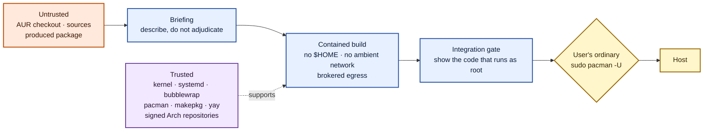

# Prolewatch architecture

Prolewatch adds inspection and containment around AUR builds driven by `yay`.
This document describes what it does, why each control is shaped the way it is,
and what it deliberately does not do.

It is written to be checkable. Where a claim rests on a measurement, the probe
or test that makes it is named; `scripts/probes/` holds the ones that need a
real kernel.

## What the attacks actually do

Every incident in the [AUR threat model](aur-threat-model.md) resolves to one
of exactly two execution sites. This is the observation the whole architecture
is built on.

| Incident | Where the payload executes |
| --- | --- |
| 2018-07 `curl \| bash` commit | build, as the user |
| 2025-07 browser-themed RAT packages | build/install, as the user |
| 2026-05 `npm install python-utils` | **`.install` scriptlet, as root** |
| 2026-06 Atomic Arch campaign | build, as the user, **and scriptlet as root** |
| 2026-07 committed ~50 KiB ELF | build, as the user |
| 2026-07 `openconnect-sso` `validator` | build, as the user, attempting `sudo` |

No documented incident depends on the installed program's later runtime
behaviour. There are two sites, and they need different controls:

- **Build-time execution as the invoking user.** This is the majority. It is
  solved by containment, and containment needs no privilege.
- **Privileged package integration.** `.install` scriptlets run in the current
  transaction; hooks, generators, and similar automatic surfaces run later;
  units and policy files remain inert until activated. `sudo pacman -U` installs
  all of them outside the build sandbox. Prolewatch therefore enumerates every
  root-relevant surface, shows the automatic bodies, and can remove any selected
  surface before handoff.

Neither site is defended by a privileged service, which is why Prolewatch
installs none.

---

## Threat model

**Trusted.** The human running `yay`, who is the sole administrator of the
machine. The host kernel, `systemd`, `bubblewrap`, `pacman`, `makepkg`, `yay`,
the signed official Arch repositories, and the host's own sudo policy.
When the optional Ollama pilot is enabled, its separately operated daemon,
backend and local model are additionally trusted for AI enrichment; their
failure can remove AI output but cannot authorize an install.

**Untrusted.** Everything in the AUR checkout. Every fetched source and archive.
Everything the build produces. Every AI provider response.

**Explicitly out of scope.** Hostile local users, multi-user shared machines,
CI isolation, and any promise that a compromised local account gains nothing.
Prolewatch will not attempt these. The correct answer for those cases is one
VM or container per principal, and the README will say so in one line rather
than the project building it.

This is a narrowing, and it is deliberate. The retired model spent most of the
engineering on the half with no user-visible benefit while detection quality
and sandbox strength — the half users actually install the tool for — stayed
"still evolving."

---

## The controls

### 1. Build containment

`makepkg` runs under Bubblewrap as the invoking user with:

- host `/usr` bound **read-only**;
- a tmpfs `$HOME` — no real home directory, no SSH keys, no browser profile,
  no shell startup files, no credential helpers;
- the package worktree as the only writable path;
- new user, mount, PID, IPC, UTS, cgroup, and network namespaces;
- no host `/run`, D-Bus, systemd socket, or host `/tmp`;
- resource limits from a transient `systemd --user` unit.

**No clean root.** Binding the host's `/usr` read-only is no worse than what
plain `yay` does today, and it removes the single largest source of complexity
in the project — the code that built one was 1,537 lines of package fetching,
database handling, dependency resolution and cache lifecycle, all parsing
attacker-adjacent input.

A clean root would buy dependency-declaration correctness, which is real but is
a packaging-quality feature `pkgctl build` and `makechrootpkg` already provide.
Its security benefit is information minimisation, and the cheap half of that is
taken below. The residual is that a build can tell roughly what is installed
from `/usr` — a fingerprint rather than a capability, bounded by brokered
egress and by the checkout being the attacker's own material. The host's
`/etc/pacman.conf`, mirrorlist and `/var/lib/pacman` are not bound. A contained
build instead sees a minimal configuration with no repositories and an empty
tmpfs package database. `pacman -Q` therefore returns no packages (and a
non-zero status) without printing a misleading missing-configuration error.
Consequently, Prolewatch-built packages deliberately contain no `installed =`
inventory in `.BUILDINFO`; avoiding that detailed host fingerprint takes
precedence over recording the usual reproducibility metadata.

`/usr/lib/modules` and `/usr/src` are masked with empty tmpfs. Measured: without
that the build reads the exact running kernel version, which is targeting
information for a sandbox escape and the same class of leak as `/etc/machine-id`.
The build needs a toolchain, not the host's identity.

**The user namespace must map uid 0.** `scripts/probes/probe-contained-makepkg.sh`
establishes this. Bubblewrap's own user namespace maps only the caller's uid, so
`chown(2)` to uid 0 returns `EINVAL` rather than `EPERM`. `libfakeroot` swallows
`EPERM` but not `EINVAL`, so the call escapes to the kernel and any `package()`
using `install -o root -g root` — a common idiom — fails the build. Ordinary
ownership through fakeroot's `stat` interception is unaffected; only explicit
`chown` breaks.

The fix is to create the namespace before Bubblewrap, mapping both the caller's
own uid and one subordinate uid to 0, and to have Bubblewrap join it with
`--userns` instead of creating its own:

```text
unshare --user --setuid 0 --setgid 0 \
        --map-users 0:<sub>:<uid> --map-users <uid>:<uid>:1 \
        --map-users <uid+1>:<sub+uid+1>:<rest> \
        --map-groups ... (the same three ranges)
bwrap --userns <fd> ...            # joins, and does not collapse the map
```

Two details in that invocation are load-bearing, and both were established by
implementing it (`internal/contain`) rather than by reading:

**`--setuid 0` is required.** Without it the anchor keeps the caller's own uid —
which the map sends to itself — so it is *not* namespace-root, capabilities are
dropped at `execve`, and the clamp write below fails with `EACCES`. That
failure presents exactly like the "the file belongs to the initial user
namespace" diagnosis that was already wrong about this once. It is now asserted
by a test rather than remembered.

**The whole subordinate range is mapped, not uid 0 alone.** An unmapped id fails
`chown` with `EINVAL` — precisely the failure this construction exists to
remove — so mapping only uid 0 and the caller leaves `65534` broken in exactly
the same way, and a `package()` doing `install -o nobody` fails for a reason
that looks unrelated. `probe-stream-filter.sh` carries the same three-range map
and a footgun note describing how it presents when it is wrong.

The build never runs as namespace-root; only the anchor is, and it gives that
up as soon as the clamp is applied. The uid 0 mapping exists only so that
`chown` fails with `EPERM` — which `libfakeroot` absorbs into its ownership
database — instead of `EINVAL`, which it does not. `probe-namespace-properties.sh`
confirms the mapping confers nothing else: inside the sandbox `CapEff` is zero,
`setpriv --reuid 0` fails, a real `chown` to uid 0 outside fakeroot still fails,
and every file the sandbox creates is owned by the invoking uid on the host.

**`--disable-userns` cannot be kept, but the property it provided can.** Bubblewrap
rejects it without `--unshare-user`, so it is mutually exclusive with
`--userns <fd>`:

```text
bwrap: --disable-userns requires --unshare-user
```

Bubblewrap alone therefore cannot stop build code creating nested user
namespaces. **The property is recovered with a ucount clamp instead**, which
needs no seccomp filter:

```text
# from ns-uid 0, before the build starts
echo 0 > /proc/sys/user/max_user_namespaces
```

`user.*` ucounts are per user namespace and `procfs` resolves them against the
opener's namespace, so this clamps the build's namespace specifically. It must
be written from **ns-uid 0**: a process whose namespace-euid is non-zero drops
all capabilities at `execve`, which is the same mechanism that leaves the build
with an empty `CapEff`. `probe-namespace-properties.sh` measures this.

Once clamped, the build cannot undo it — raising the limit needs
`CAP_SYS_RESOURCE` in the owning namespace and the build holds nothing. The
clamp survives the `bwrap --userns` join, blocks nested namespace creation, and
does not regress `fakeroot`. `setns()` to a foreign namespace is not a bypass
either: the build has an isolated PID namespace and no host `/proc`, so it has
no route to a foreign namespace descriptor.

This is strictly better than the seccomp route it replaces. There is no
`clone3`/`ENOSYS` fallback to maintain and no toolchain compatibility matrix to
validate.

This needs subordinate uid and gid ranges. Existing accounts do not always have
them; when `prolewatch setup` or `prolewatch doctor` reports them missing, the
remedy is to let `shadow` allocate unused ranges under its own database locks
and the administrator's `/etc/login.defs` policy:

```bash
sudo usermod --add-subids -- "$(id -un)"
prolewatch doctor
```

The command must not contain a range chosen by Prolewatch or copied from this
document: overlapping delegations let accounts map the same host IDs, and
computing a free range before invoking `sudo` creates a read-then-write race.
This explicit administrator action installs no privileged component. It does
authorize the account to map the allocated IDs inside user namespaces, but it
does not grant host root or capabilities in the initial namespace. Prolewatch
validates the width, arithmetic, ownership and cross-account non-overlap of the
file-backed delegation, then `doctor` creates the real namespace and reads its
maps back before setup may change `yay`.

### 2. Two-phase network policy

The build has no direct network route in any phase, and that is a property of
the namespace rather than of the environment. `--unshare-net` is unconditional:
a brokered phase gets the same empty network namespace as an offline one, and
reaches the broker through a unix socket bind-mounted into the sandbox, which
crosses a network namespace because it is a filesystem object. Nothing about
brokering needs the host network, so nothing gets it — a phase that shared the
host network in order to "reach its broker" would let package code drop the
proxy variables and `connect(2)` straight out, past the prompt, the host and
port check, and the byte budget. `probe-namespace-properties.sh` and
`TestContainedProcessCannotReachTheHostNetwork` measure it.

The broker's sockets live in a private, unpredictable, short-lived directory
directly below `/tmp`, while reports and acquired sources remain under the
configured state root. This is not a relaxation of the filesystem boundary:
host `/tmp` is still replaced inside Bubblewrap, and only the broker's client
subdirectory is explicitly bound at `/broker`. The short host path is required
because Linux limits Unix-domain socket paths to roughly 108 bytes; inheriting
an arbitrarily long `XDG_STATE_HOME` would otherwise make a valid build fail
before its prompt agent could bind. The directory is removed with the phase.

Private, loopback, link-local, multicast, documentation, host-subnet, and the
IPv6 translation/special-use ranges stay blocked unconditionally throughout, by
one `AddressPolicy` shared by every consumer — two copies of a reserved-range
list is the same defect class as a strip set and a filter set computed
separately. That policy also captures this host's own interface addresses and
directly attached subnets, which no reserved-range list can recognise, so an
enumeration failure fails the operation instead of yielding a policy that looks
complete and is quietly missing exactly those addresses.

**Acquisition runs on the trusted side, and no longer goes through the broker
at all.**

A proxy could not enforce this. HTTPS reaches a proxy as `CONNECT`, which
carries host and port and nothing else — the same opacity that makes content
verification the toolchain's job rather than the broker's. So the operation
moves rather than the claim weakening: Prolewatch evaluates the `PKGBUILD` in containment, freezes the source
set, and **fetches the declared non-VCS sources itself**, with its own HTTP
client, into `SRCDEST`, before any package code runs. `makepkg` then finds them
present and verifies checksums.

Exactness is now by construction — the request is the declared URL because
Prolewatch composes it — and three properties follow that the proxy design could
not offer at all:

- **The acquisition window stops being an execution window.** `makepkg` sources
  the `PKGBUILD` on every invocation, `--verifysource` included, so
  author-written top-level shell runs during retrieval;
  `probe-verifysource-execution.sh` established that. With the sources already
  present, that shell runs with **zero egress**. A package with no VCS sources
  never has an open network while its own code executes. This closes what was an
  open question, rather than bounding it.
- **Divergence fails closed structurally.** A `PKGBUILD` can compute `source=` a
  second time and produce different URLs. Measured: `makepkg` then looks for a
  file that was never fetched, finds nothing, and aborts with no network to
  reach it. There is no allowance to widen and no policy decision to get wrong.
- **The request-count-and-timing channel closes.** The fetcher's requests are a
  function of the frozen list alone, not of anything package code does. The
  earlier design could only bound that channel; this one removes it.

Fetching an attacker-chosen URL from trusted code grants the attacker nothing.
The URL was consented to at the briefing, the client sends no credentials, and
the bytes land in the same untrusted workdir either way.

Each checkout gets a source directory private to it and to the current `yay`
transaction. The whole directory is bind-mounted read/write into the untrusted
sandbox during verification, so a single shared one let a package overwrite or
delete another package's sources and let concurrent transactions race through
colliding basenames. Nothing is lost by scoping it: acquisition re-fetches the
frozen set every transaction, so the shared directory was never a cache.
Directories untouched for a week are pruned, because scoping them means they
accumulate.

**Every phase resolves that directory, not just the one that filled it.** `yay`
drives `makepkg` as a sequence of separate processes, and only `--verifysource`
performs the trusted-side fetch; the later ones start with nothing carried over.
So `prepare`, `build` and `skip` each derive the same transaction- and
checkout-keyed path again and bind it as `SRCDEST`. Without that, `makepkg` looks
for the sources where it would have put them by default, finds nothing, and
downloads them a second time — from a phase in which package code is running,
against a host the user has every reason to approve, and with the build
succeeding either way so that nothing points at it. The reuse is one-directional:
only `verify` writes into the directory from the trusted side, and a missing
non-VCS source in a later phase is an absent file rather than a second fetch.

The store cannot stay merely private, though, because package code runs with it
mounted. `makepkg`'s `ensure_writable_dir` refuses to run against a read-only
`SRCDEST`, and VCS checkouts under it are updated in place, so the directory has
to be writable — which left the acquired bytes deletable by the top-level shell
that `makepkg` executes on every invocation. Deleting a source and letting the
same run fetch it again, from a URL that shell had just recomputed, turned
"fetched once on the trusted side" into "fetched once unless the package objects".
So each acquired file is bind-mounted **read-only over itself** inside the
writable directory: `unlink` and rename return `EBUSY`, a write returns `EROFS`,
and the directory around them stays writable for `makepkg` and for VCS state.
Read-only binds are applied after writable ones for exactly this reason.

**The allowance is the briefing-time URL set, frozen.** `source=` is not a static
declaration; it is an array *computed by attacker-controlled shell* when
`makepkg` sources the `PKGBUILD`. So every evaluation runs inside containment
with zero network — including whatever derives the briefing's source list. A
committed `.SRCINFO` is maintainer-authored and can disagree with the
`PKGBUILD`, so the freeze regenerates it with `makepkg --printsrcinfo` and
ignores the committed copy.

That was true of the freeze and not of the briefing. The scanner built the
user's source list by parsing the committed file, so a package could show one
set of hosts while acquisition fetched another — the exact case the static
`.SRCINFO` comparison declines to check, because deriving remote sources needs
arbitrary Bash. The freeze now persists the `.SRCINFO` text it derived, outside
the source store so package code cannot rewrite it, and the post scan describes
the package from those bytes. The pre briefing runs before any evaluation and
still shows the committed metadata; that is what "before anything runs" means,
and the post briefing is the one that precedes the build.

There is one useful pre-evaluation subset that does not require guessing what
Bash will do: direct checksum-array assignments whose elements reduce to static
words. The recipe scan compares those `b2sums`, `sha*sums`, and `md5sums`
arrays, including architecture suffixes, with the committed `.SRCINFO`. A
difference is a HIGH `srcinfo-mismatch`: the metadata a reviewer or AUR helper
reads names a different content binding from the one `makepkg` will enforce.
Multiline literal arrays and static variable references are handled; command
substitution, indexed or conditional reassignment, and any other unresolved
shape are left unknown rather than guessed into a finding.

`egress.FreezeDeclaredSources` is the single owner of that set. `Allowance` has
unexported fields and no other constructor, because the way this requirement
fails is not that somebody disagrees with it — it is that a second, cheaper
derivation site appears later.

**Evaluation carries the same kind of resource envelope as the build, tighter.**
It is arbitrary shell, so it runs in a transient `systemd --user` unit with its
own memory, CPU, task, runtime and output limits — every one of them a
floor-capped narrowing of the configured build limits, and the timeout capped at
a minute. Bubblewrap supplies namespaces and nothing else: under plain
containment a top-level fork bomb or `while :; do :; done` exhausted the host
and hung until the user intervened, before the constrained build ever started.
`contain.RunLimited` is the primitive; `contain.Run` remains for commands that
are not package-authored.

**Decoder budgets are separate from output budgets.** The scanner's entry, byte
and depth limits count what comes *out* of a decompressor; they say nothing
about what it allocates on the way in, and a decompressor sizes its buffers from
numbers the attacker wrote. `github.com/ulikunitz/xz` treats a stream's declared
LZMA2 dictionary as a floor rather than a ceiling and allocates it in full before
decoding a byte, so a few hundred well-formed bytes cost the trusted scanner up
to 4 GiB. The declaration is read from the block header and refused above 128 MiB
— twice what `xz -9` uses — and zstd is opened with an explicit window, memory
and concurrency ceiling. The privileged-integration gate additionally runs under
`contain.RunLimited` rather than `contain.Run`: it parses an archive the package
produced, and a namespace bounds what that parse can reach, not what it can
allocate.

The parse is bounded to match: at most 256 declared sources and a bounded line
length, and an overflow **fails** rather than returning what fitted. A truncated
parse of an attacker-authored `.SRCINFO` is the worst available outcome — the
user is shown a short source list, agrees to it, and the entries that did not fit
are exactly the ones nobody looked at.

**Acquisition budgets are the transaction's, not the source's.** Transfer bytes,
elapsed time, and the `SRCDEST` filesystem reserve are shared by every fetch in
one transaction. Applied per source — as they were — a documented 8 GiB ceiling
is really 8 GiB times however many sources a package cares to declare, which is
what the source cap above closes from the other side. A response body that stops
making progress is abandoned after the idle timeout: a connection that is healthy
at the TCP level and simply silent is covered by no HTTP timeout. Every failure
path removes the partial file, so `makepkg` never finds a truncated source and
fails its checksum for a reason nobody can trace back to here.

**Redirects are followed transitively, with the address check applied per hop.**
`probe-redirect-chains.sh` measures real chains: a GitHub tag tarball goes
`github.com` → `codeload.github.com`, a release asset goes
`github.com` → `release-assets.githubusercontent.com`, while `crates.io` and
`proxy.golang.org` serve directly. A vetted per-registry host map is safer in
principle and the probe is the argument against it: two of four pre-registered
hop predictions, written by a reviewer working from current knowledge, were
already wrong. A hand-maintained map would ship stale on two of three registries
on day one.

What is *not* transitive is the address check — every hop is dialled through the
checked dialer, so a redirect into private or link-local space is refused at
connect time regardless of who sent it. **That per-hop range block is the only
check here that is a security boundary.** A redirect carries nothing out: the
`Location` URL is composed entirely by the redirecting host, and the fetcher
attaches no credentials at any hop, so there is nothing for a redirect to carry
anywhere.

There is deliberately no prompt on a hop "never seen for that registry", and no
"chain changed since last fetch" line. Both would need persistent per-registry
state, contradict the no-persistent-grants rule, and fire on exactly the routine
CDN drift the probe measured — teaching users to ignore them. That is cry-wolf
decay: prompt fatigue one notch quieter, because a line nobody reads still looks
like a control on a feature list.
Observed hops are worth *seeing*, not *asking about* — the transaction report
records every host contacted during acquisition (`Report.AcquiredHosts`), which
needs no cross-run storage and gives an honest user the same visibility without
a question they have no basis to answer.

**VCS sources stay networked, at host granularity.**
A `git+https://` source is a protocol conversation, not a fetch: the client
requests `<repo>/info/refs?service=git-upload-pack` and POSTs to
`<repo>/git-upload-pack`. Those run under `makepkg` inside containment with the
broker closed to the frozen VCS host set (`Acquisition.VCSHosts`, carried to the
broker process as `Config.AllowedHosts`). Host granularity, not path
granularity, because that traffic does go through the proxy and a proxy sees
`CONNECT`.

That set is enforced before resolution and before the prompt, and only in the
verify phase, because only there is it knowable: acquisition has already fetched
the non-VCS sources from the trusted side, so a declared VCS host is the one
destination `makepkg` can still legitimately need. Prompting for anything else
would be asking the user about a host the package never declared — a question
with no basis for an answer, and one that teaches them to approve undeclared
destinations. `prepare` and `build` keep the general prompt path, because a
build dependency cannot be frozen in advance. Content is pinned by the `#commit=` or
`#tag=` fragment where the `PKGBUILD` supplies one; where it does not, the
declared host controls the content completely — a property of the `PKGBUILD`,
belonging in the briefing rather than in a prompt.

**Build phase: default zero egress; the prompt is the anomaly detector.**
With acquisition separated out entirely, a mid-build connection attempt is
inherently unusual, which is what restores the prompt's meaning:

- Recognized ecosystem fetches produce one aggregated prompt per build rather
  than per-host interrogation. Recognition is by exact command shape, not by
  executable name: `knownBuildNetworkStep` accepts `cargo fetch --locked` and
  `go mod download`, and nothing else. `npm install` and `npm ci` are
  deliberately excluded — they run package-authored lifecycle scripts, so an
  aggregate grant for them would not be a grant to a registry alone:

  ```text
  cargo requests crates.io for the 312 crates listed in Cargo.lock.
  cargo verifies each download against the lockfile.
  ```

  **The verification claim belongs to `cargo`, not to the broker, and the
  prompt must say so.** The broker is an HTTP(S) proxy; registry traffic goes
  through `CONNECT` tunnels it cannot see into, so it verifies no content
  hashes at any point. What binds content is the toolchain checking each
  download against `Cargo.lock` or `go.sum` — inside containment, using the
  trusted host toolchain.

  Recognition is therefore exactly: destination matches the ecosystem's
  registry hosts, a lockfile is present, and the count comes from parsing that
  lockfile in the checkout. Nothing more. **The aggregate grant is scoped to
  those registry hosts, not to whatever the recognized tool asks for** — a
  recognized Cargo build that requests `example.com` falls out of the
  aggregate and into the ordinary pause prompt.
- Everything else **pauses** the connection for the outer honest-user TTY
  prompt, per exact host and port. The build keeps its compiled state either
  way. This now fires rarely — and "the build is
  contacting a host it never declared" is precisely the 2018 `curl | bash`
  signal.

Phase separation is a strengthening, not only a fatigue fix. A host approval is
usable by every process inside the current makepkg phase: the broker cannot tell
a Git checkout from author-controlled shell that contacts the same host. It
therefore dies with that phase. Carrying an approval for `github.com` from
source verification into `prepare()` or `build()` would open the same broad
endpoint to package code, and popular source hosts are useful exfiltration
sinks. Under this design, later phases gain no grant from acquisition.

**The tunnel's outer name is checked, not only the dial.** `CONNECT` and SOCKS
hand the client a byte pipe to a checked IP address, and an IP is not a host: on
a shared reverse proxy or CDN one address serves any number of virtual hosts, so
a client granted `approved.example` could name `attacker.example` and reach a
different service over the approved connection, without the broker being asked
and without leaving the frozen VCS host set. The first bytes of every tunnel are
therefore read and required to name the approved host, then replayed to the
upstream unchanged. An approved IP literal is exempt, because no host guarantee
was displayed for one.

**What that check does and does not cover, precisely.** It reads one of two
things: a plaintext HTTP `Host` header, or the server name in the first TLS
ClientHello. Both are outside the encryption, which is the only reason they can
be read at all. Once a matching ClientHello has been replayed, the rest of the
connection is an opaque encrypted stream: a later HTTP `Host` header or an
HTTP/2 `:authority` *inside* TLS is not visible and is not enforced. A client
that presents an approved SNI and then addresses another application host,
where the endpoint routes on that value, is not stopped by this control.

That is a limit of the mechanism, not an oversight to be fixed with a stricter
parser. An opaque proxy cannot promise to inspect a value it deliberately does
not decrypt, and a proxy that did decrypt it would be a TLS-terminating
middlebox holding the user's traffic in clear — a far worse trade. The control
is honest defense in depth against the simple virtual-host mismatch, and the
approval itself remains one destination for the current makepkg phase. An
approved popular host is already a broad endpoint at the path and account layer,
which no host check addresses.

**A known compatibility limit.** The ClientHello is read from exactly one TLS
record. Fragmenting a handshake message across records is legal and would be
rejected here, so the connection would fail rather than be tunnelled unchecked.
No TLS stack used by the supported clients — git, curl, Go, Cargo, npm — does
this by default, so the reassembly code has not been written on speculation.
The real-package corpus is where that assumption gets tested; if a legitimate
client fragments, this is the first place to look.

**The post scan inventories two roots.** Trusted acquisition writes declared
remote sources into the transaction's source store and binds it as `SRCDEST`,
so those bytes are not in the checkout: `makepkg --verifysource` exits before
extraction, and extraction is what would have linked them back. The post scan
therefore opens the checkout *and* that store as one inventory — one namespace,
one manifest, one content binding — and the marker's re-bind covers both. A
scan that looked only at the checkout found every declared extractable source
absent and hard-blocked, which is every ordinary AUR package.

The two roots share a namespace because `makepkg` resolves a local source
against the build directory and a remote one against `SRCDEST`, so for any
package that builds they do not overlap. A name in both is a package shipping a
file called exactly what it downloads, and is refused rather than merged.

**Declared sources are fetched over HTTP(S) only.** The broker permits ports 80
and 443, so `git://` and `git+ssh://` sources cannot be retrieved however they
are classified. SSH is not a missing port but a missing credential story, and a
build holding the user's keys is what containment exists to prevent. The pre
briefing names an unsupported transport as a compatibility finding, so the user
learns before the build rather than when acquisition fails.

**Consent precedes resolution, because resolution is itself egress.** A DNS
query for `<encoded-data>.attacker.example` reaches the attacker's authoritative
server whether or not the user then denies the connection. So the prompt is
raised on the name and port alone, before the resolver is called, and the
destination limit counts destinations *asked about* rather than destinations
approved — otherwise denied names stay an unbounded channel. A test's resolver
seam records a failure if it is invoked before the authorization seam.

The destination cap is not a work cap: an approved name can be requested
repeatedly. A separate per-build-phase request budget counts every accepted
proxy connection, including rejected and repeated attempts. Exhausting it
terminates the broker and fails that phase closed.

**Every answer is checked in full, and the addresses that were checked are the
addresses dialled.** DNS is resolved once per connection, a single non-public
address rejects the whole answer, and nothing re-resolves between the check and
the dial — resolving again after the check is a DNS-rebinding TOCTOU. The
consequence of consenting first is that a grant cannot bind the answer: an
approved name that later resolves to a *different public* address does not
re-prompt. That is the deliberate trade. What the binding actually defended
against — a rebind into private or link-local space — is unaffected, because
publicness is re-checked on every resolution, not inherited from a grant.

**Grant lifetime.** Positive network answers exist only in the broker's
in-memory `host:port` map. One broker serves one makepkg phase, so its grants die
when that wrapper exits. `verify`, `prepare`, and `build` never inherit one
another's answers; a repeated VCS destination therefore asks again. That
repetition is deliberate, because the broker sees no trustworthy signal that
distinguishes makepkg's checkout from arbitrary package code in `prepare()`.
Declared-source and recognized-operation metadata explain the prompt but grant
no authority and do not change its scope.

There is no persistent or "always allow this host" option. Either would be
inherited by exactly the package code or malicious update that should re-prompt.
Removing the duplicate VCS question safely requires trusted-side, exact-source
acquisition followed by offline makepkg phases; static prompt context cannot
provide an equivalent operation boundary.

One honest note on what remains: a `PKGBUILD` can encode data into the URLs it
computes, so the declared set is itself a low-bandwidth channel. It is bounded
by what is visible inside containment — the checkout, which is attacker-authored
material they already possess — so it is worth stating, not worth a control. The
user has already seen these sources in the briefing, which is the single consent
point for the declared set.

### 3. The privileged-integration gate

New, small, and the highest-value control in the redesign.

After the build, enumerate every registered root-relevant integration surface the produced
archive carries. Surfaces that run or grant privilege without a later user step
stop for a decision and show their bounded body; deferred and passive surfaces
are listed. Any selected surface can be removed:

```text
prolewatch: foo-bin carries 2 surfaces that run as root on their own.

  [1] .INSTALL — post_install, runs as root during this transaction
      │ post_install() {
      │     npm install -g atomic-lockfile
      │ }

  [2] usr/share/libalpm/hooks/zz-foo.hook — runs as root on EVERY
        subsequent pacman transaction. No pacman flag can suppress it.
      │ Exec = /usr/bin/foo-helper --update

  [k] keep all   [1] strip 1   [2] strip 2   [s] strip all   [c] cancel
```

This is an action, not a warning. It addresses the one execution site
containment cannot reach.

Every way of not answering fails closed to `ExitPolicyBlock`. No terminal, an
end of input, five unrecognised answers, and silence past `ui.GatePromptTimeout`
(15 minutes) all stop the install rather than resolving into the permissive
choice, because this is the last decision before `pacman` runs package code as
root and the artifact scan does not stand in for it. The timeout is polled per
read, so a user who is typing keeps resetting it and only genuine absence
expires; `EINTR` is re-polled against the remaining budget so that a runtime
signal cannot cancel an install. A timeout reports itself separately from an
absent terminal, because "you walked away" and "there is no terminal here" need
different advice.

Enter still selects `keep`, deliberately. The reflex-answer concern it raises is
real, but the accidental path is already closed upstream - `safe.OpenPromptTerminal`
flushes typed-ahead input with `TCIFLUSH`, so a queued newline cannot answer
this prompt - and requiring `k` would only relocate the reflex on the most
frequently shown prompt in the product. Unlike the network prompt, which demands
an explicit `y` because denial there is free, this gate has no safe
non-permissive default: stripping a surface a package needs produces a broken
install.

**The build audits the packages makepkg planned, not the directory's
contents.** yay asks `makepkg --packagelist` immediately before every build -
measured against 13.0.1, the sequence is `--printsrcinfo`, `--verifysource`,
`--nobuild`, `--packagelist`, build - and the wrapper already validates that
answer against the checkout. It is now persisted per transaction and checkout,
and the build phase audits exactly those paths.

The first invocation in that sequence necessarily precedes `AURPreInstall`:
yay needs the locally generated package base and version before it can construct
the hook event that creates the pre marker. `--printsrcinfo` is therefore one
exact markerless bootstrap profile, not an authorised lifecycle phase. It runs
with no network or source store inside the same Bubblewrap boundary and the
tighter PKGBUILD-evaluation CPU, memory, task, runtime, and output ceilings. Its
stdout reaches yay only if it is non-empty, valid UTF-8 without terminal control
bytes, and the runner reports isolated containment. The hook then scans the
checkout after this evaluation, so top-level PKGBUILD shell can mutate only
material that the ensuing recipe briefing will include. Every later makepkg
profile still requires its phase-correct content marker.

Selecting output with a `*.pkg.tar.*` glob was a second, weaker discovery model
for the same question. The build directory is yay's persistent cache, not a
fresh output directory: `cleanAfter` is off by default and the hook deliberately
does not change it, so after an upgrade the previous version's archive and its
detached `.sig` are still there and all of them matched. An ordinary upgrade
could therefore prompt about a scriptlet in a package yay was never going to
install, strip an archive unrelated to the transaction, or quarantine the good
new package alongside the cached ones. Fail-closed, but squarely against the
user model the gate exists to serve.

**One package format, checked before the build.** `makepkg` supports plain tar
and nine compressors as administrator policy; the mandatory integration gate
enumerates and rewrites zstd only, and a strip must re-emit the format its
filename claims, so widening this means carrying every compressor rather than
detecting them. A `.pkg.tar.xz` package used to pass content inspection and then
fail the gate with a magic-number error, quarantining the archive with a message
that said nothing about `PKGEXT`. The package list names the exact output files,
so the effective policy is read from it and reported before the build runs.

**The registry is a maintained list, not a closed proof.** Expanding a known
class across every documented search-path root is mechanical, and the two
independent platform tests do exactly that much: `pacman-conf HookDir` answers
for hook directories, `systemd-analyze unit-paths` for the unit load path.
Neither discovers a *class* nobody thought of, and a later review found four
that had been missed — `/etc/ld.so.preload`, systemd's `system-sleep` and
`system-shutdown` hooks, and NetworkManager's dispatcher directories — all of
which run package-installed executables as root with no enabling step. They are
registered now. Any service on the system can define another, so the honest
claim is bounded: the registered classes are enumerated structurally and
completely, and a mechanism outside them is outside the guarantee. User-facing
text says that rather than promising every root-relevant surface.

Two details of the rendering are load-bearing rather than cosmetic. Every line
of package-authored content carries a quote marker (`│`), because indentation
alone is not enough: a scriptlet containing the tool's own prompt text renders
as a plausible Prolewatch line that merely happens to be indented, and a user
scanning quickly can answer the wrong one. And bodies are bounded, because a
long scriptlet that scrolls the choice off the screen leaves the user answering
whatever the package chose to leave visible. Both are tested against content
written to forge the prompt. When a body is truncated, the gate prints a
shell-quoted `bsdtar -xOf` command for inspecting that exact archive member in
another terminal before answering.

The default is **keep**, and an unrecognised answer re-asks rather than
choosing. Stripping a surface a package genuinely needs produces a broken
installation, so the destructive option is never what a mistyped key does.

**The scriptlet is not the only privileged-integration channel, and the gate
must enumerate all of them.** A package payload can also carry:

- **libalpm hooks** — a file installed into `/usr/share/libalpm/hooks/` runs
  as root on *subsequent* pacman transactions, and `--noscriptlet` does not
  touch it;
- **systemd units, sysusers.d, tmpfiles.d entries, and udev rules** — deferred
  privileged integration, activated later by trusted hooks.

All of these are visible in the archive listing, so the gate's display
enumerates every privileged-integration surface the package carries, not just
`.INSTALL`. A gate that reported only the scriptlet would hand an attacker who
knows the gate exists a better channel and print "no scriptlet" over it —
active false reassurance. The 2026-05 attackers used `.install` because it was
the easiest channel, not the only one.

Correctly scoped, the structural claim is: **a package cannot hide *that* it
carries registered privileged integration.** It can obfuscate what the code
does. Automatic bodies are bounded and quoted in the prompt; listed passive
surfaces may require separate archive inspection. This scoping matters; an
unscoped "cannot be evaded" claim would repeat the overstatement this design
exists to avoid.

`scripts/probes/probe-integration-gate.sh` establishes how it must be built.
`yay` exposes exactly three Lua events — `AURPreInstall`, `AURPostDownload`,
and `PostInstall` — and **none of them sits between build completion and
`pacman -U`**. The gate therefore lives in the `prolewatch-makepkg` wrapper,
which already sees the built archive.

Enforcement does not depend on `yay` cooperating. `.INSTALL` is extractable
from the archive for display, and removing it from the archive Prolewatch hands
back is equivalent to `--noscriptlet` for that package; `pacman` parses the
rewritten package normally. `.MTREE` becomes stale and must be regenerated, or
`pacman -Qkk` will disagree.

Two constraints on the rewrite path:

1. **Rewriting breaks the content binding.** The briefing described, and any
   approval was bound to, the archive the build produced; stripping `.INSTALL`
   and regenerating `.MTREE` hands `pacman -U` different bytes. After any
   rewrite, Prolewatch re-hashes the result and re-binds the transaction to it
   before handoff. The rewrite code itself parses hostile archives, so it must
   stay minimal and structural — member removal and `.MTREE` regeneration,
   never content transformation.
2. **Filter the stream; do not extract, repack, or regenerate.** Read the tar
   entries, skip the stripped members, copy every other entry with its header
   intact, and rewrite `.MTREE` by removing the corresponding lines from the
   original gzipped mtree text. Nothing else changes by a single byte.

   Two wrong approaches were measured before this one. Extracting and repacking
   as the ordinary user loses ownership — every file becomes the invoking uid,
   and `pacman -Qkk` then reports a wrong owner for the whole package. Doing it
   under `fakeroot` fixes ownership (a `fakeroot` extract repopulates its
   database, so even a non-root owner such as `uid=65534` round-trips
   correctly), but *regenerating* `.MTREE` is still not byte-faithful: matching
   `makepkg`'s exact `bsdtar --options` string across `makepkg` versions is a
   maintenance burden, and getting it wrong is silent. A regeneration attempt
   here added `md5digest=` entries the original did not contain.

   Streaming needs neither `fakeroot` nor an option string. Go's `archive/tar`
   and `klauspost/compress/zstd` are already dependencies and do this natively.
   Directories emptied by a strip must be pruned, and **the pruned set must be
   computed identically for the archive and for the `.MTREE` filter** or the two
   disagree.

   The rewrite lands in a directory created beside the package with an
unpredictable name, exclusively, and the output file is opened `O_EXCL` and
`O_NOFOLLOW`. All three matter and none is decoration: the package's own
directory is the only place a same-filesystem atomic rename can target, so the
path is attacker-adjacent by necessity. With a predictable name and no
`O_NOFOLLOW`, package code could leave a symlink there during its build and have
a trusted process truncate the user's own file — and could make the strip look
attractive by carrying a surface worth removing.

One cosmetic consequence to own rather than let `pacman -Qi` surface
   unexplained: `.PKGINFO`'s installed-size becomes stale. `pacman` uses it for
   reporting, not verification.
3. **The gate's archive handling runs contained.** The rewrite is now the only
   enforcement mechanism, so archive parsing happens on every gated package.
   Streaming with Go's own reader avoids handing `bsdtar` hostile input for the
   rewrite itself, but extraction for display and enumeration still parses
   attacker-produced bytes. That work runs inside the same containment sandbox —
   no network, tmpfs, worktree only.
4. **The rewrite is the mechanism, not the fallback.** `--noscriptlet` covers
   `.INSTALL` and nothing else, and is transaction-wide in `pacman` so it
   cannot express a per-package choice anyway. Since hooks, units,
   `sysusers.d`, `tmpfiles.d`, and udev rules can only be removed by rewriting,
   carrying `--noscriptlet` as a second path would mean two code paths, two
   content-binding stories, and a "decline" that means different things for
   different surfaces. One structural mechanism covers every surface
   uniformly. `--noscriptlet` stays documented as something the user can pass
   to `yay` themselves; Prolewatch does not build around it.

Stripping is not free, and the gate must not pretend otherwise. Removing a hook
or a `sysusers.d` entry from a package that genuinely needs it produces a
broken installation, so the choice is per-surface, defaults to leaving the
package intact, and what was removed is recorded in the report. For a package
that is actually hostile the right answer is not to install it at all; the
strip path is for the ambiguous middle.

`probe-integration-gate.sh` confirms the asymmetry that makes enumeration
necessary, and it is starker than "no `--nohooks`". `pacman.conf(5)` defines
`HookDir` as adding directories *"in addition to the system hook directory
(`/usr/share/libalpm/hooks/`)"*, and that system directory is compiled into
`libalpm` rather than configured. `--hookdir` adds; it never replaces.

So there is **no pacman flag, and no pacman configuration, that can suppress a
package's installed hooks.** A file landed in `/usr/share/libalpm/hooks/` runs
as root on every subsequent transaction, and the user's scriptlet decision is
irrelevant to it. Enumeration is not thoroughness here — without it the gate
prints "no scriptlet" over the channel an attacker who has read this document
would actually use.

### 4. The briefing, not the verdict

Deterministic inspection stops being a gate and becomes a description. Instead
of `ALLOW` / `AUTO-ALLOW` / `BLOCK`, produce an honest account of what this
package will do:

The rendered briefing leads with the change being installed and where the
material comes from, because those are what make the findings below them
interpretable, and the outcome line states what happens next rather than
passing a verdict:

```text
Outcome: NEEDS YOUR DECISION
Change: 1.2.3 -> 1.3.0, explicitly installed
Changed: 2 changed, 1 added since the previous scan: PKGBUILD, foo.install
Sources: 4 source(s) - github.com, cdn.unknown-host.tld (x2), local
Binding: 3 pinned to exact bytes, 1 mutable · content accepted uninspected · checksums passed
Contacted: cdn.unknown-host.tld, codeload.github.com, github.com
Stripped: .INSTALL from foo-bin-1.2.3-any.pkg.tar.zst
```

**The context lines come from data the tool already had.** The Lua hook has
always passed yay's transaction context - target and installed version, install
reason, devel flag, dependency lists - and the report has always carried a
manifest diff against the previous scan and per-source binding and verification.
None of it was rendered. The terminal printed the package base and an internal
phase name, which describes Prolewatch's own structure rather than the decision
in front of the user. "`foo` 1.2.3 -> 1.3.0, explicitly installed, PKGBUILD and
`.install` changed, one source is a mutable git ref" is a thing a person can
act on; "`foo / post`, 3 sources - github.com (x2)" is not, and the same
critical finding reads differently under each.

**Phases are an implementation boundary, not a presentation model.** One
ordinary package produced four full briefings - the hook's pre scan, the hook's
post-download scan, the wrapper's rescan after `prepare`, and the artifact
review - and three of them said "NO BLOCKING FINDINGS" about a package nobody
had a question about. Different bytes exist at different moments, so the
separate scans are correct; printing a full report for each of them is not what
that correctness requires. A phase that found nothing, needs no answer, and is
not the last word before installation now renders as one line carrying the
change and the report id. The artifact phase always renders in full: it is the
briefing shown immediately before `pacman` receives the archive, and that is
the moment to be complete rather than brief.

**An unchanged finding is decided once per transaction, not once per scan.**
The recipe gate must remain a decision boundary because it runs before source
acquisition; deferring every decision until sources arrive would fetch material
from a recipe the user had already rejected. After an exact recipe-snapshot
override, the sources gate therefore reloads the live transaction's `pre`
marker and may treat an identical deterministic finding as already decided.
This is deliberately narrower than reusing an approval token:

- the source report must be the live marker's current-policy `allow/override`
  report, with complete coverage and no structural or prompt-injection failure;
- package base, policy fingerprint, process identity, complete finding identity,
  and the canonical hash of the finding file's full manifest entry must match;
- hard blocks, coverage findings, and AI findings never carry;
- any missing, malformed, stale, or mismatched evidence falls back to the normal
  question rather than failing open or failing the transaction.

The later scan, report, and AI review remain complete. Carried findings stay in
severity order and are marked in blue as approved at the recipe gate; only their
contribution to the new deterministic decision and their duplicate AI-guidance
request are removed. A new deterministic or AI finding still stops normally.
If a new finding opens the inspector, unresolved context is shown first and the
unchanged previously approved context remains available below it. A carry-only
report says `NO NEW DECISION NEEDED`, never `NO BLOCKING FINDINGS`.

There is a residual contextual risk: arrived sources might change the meaning
of an unchanged recipe finding without producing any new finding. The sources
are still fully scanned and, when configured, reviewed by AI, but neither static
mechanism proves all cross-file behavior. Avoiding a repeated byte-identical
prompt is a fatigue tradeoff, not a claim that the later context is equivalent.

**A network prompt names the request.** "The build is asking to reach
`crates.io:443`" is not answerable during a nine-package upgrade. The prompt
now names the package and the phase, and says whether the destination appears
anywhere in that package's declared sources - which is the single most useful
fact about a mid-build connection, and the one only Prolewatch is in a position
to state. It explains and never decides: a declared host still has to be
approved, and the resulting `host:port` grant lasts only for the current
makepkg phase.

Both package-review decision kinds ask the same way — `[y] Continue · [N]
Abort`, with Enter defaulting to abort — and the severity lives in the briefing
above rather than in the shape of the question. When AI was skipped solely by
phase selection and an attested reviewer remains available, the same prompt
also offers `[r] Run AI review now`. That action reruns the complete scan and
evaluation, writes a new exact-snapshot report, and refreshes the question; it
never edits old evidence or changes the configured phase set.
There is deliberately no typed-word confirmation. Recognised findings describe
rather than block, so this prompt fires on ordinary packages, and a ceremony
repeated on ordinary packages becomes muscle memory. Typing a word by reflex is
not a more considered decision than pressing a key by reflex.

What bounds a mistake is the shape of the approval, not the shape of the
question: it covers this exact content and this policy, once, and it can never
cross a structural finding. The heavier confirmation survives where it still
earns its keep — the standalone `prolewatch approve` command asks for the
package name and hash prefix, because it is invoked deliberately and rarely,
and typing the hash binds the decision to visibly different content.

Every prompt goes through `safe.OpenPromptTerminal`, which reads and writes
`/dev/tty` **and discards input typed before the question was asked**. Both
halves are necessary and only the first was there originally.

Using `/dev/tty` stops package output becoming input directly. It does nothing
about typeahead: a package can print a convincing fake prompt as ordinary build
output, the user answers it while the real work is still running, and the
keystroke waits in the terminal's queue until the next genuine prompt reads it.
The answer is then bound to a question the attacker wrote. Reading from
`/dev/tty` does not help, because the buffered keystroke is on `/dev/tty`. A
`TCIFLUSH` immediately before rendering closes it, and living in one shared
primitive is what stops it being remembered on one prompt and forgotten on
another.

Build output is still replayed raw — that is what plain `yay` does, and
escaping it would cost every build its compiler colours and progress output for
a benefit the flush already provides. The terminal is reset afterwards, so a
package cannot leave styling, a scroll region, a hidden cursor or an alternate
screen behind for the briefing to be drawn onto.

A prompt that only appears when stdin happens to be a terminal would silently
vanish, because the wrapper runs beneath `yay` and `yay` is free to redirect
`makepkg`'s streams. When a decision is coming, the briefing omits the `prolewatch approve`
instructions — telling a user to run a command in another shell immediately
above a prompt asking the same question sends them away for no reason. Where
there is no terminal to ask, the instructions appear instead.

There is deliberately no `AUTO-ALLOW`. It named an outcome the deterministic
pass had already reached and credited the model with reaching it; the AI's
confidence is reported on its own line instead. The four outcomes are
`NO BLOCKING FINDINGS`, `NEEDS YOUR DECISION`, `STRUCTURAL FAILURE - NOT
APPROVABLE`, and `APPROVED BY YOU`.

```text
foo-bin 1.2.3 → 4 sources: github.com, crates.io, cdn.unknown-host.tld (×2)
  ! cdn.unknown-host.tld is not referenced by any previous version
  ! repository contains a 47 KB ELF: ./validator
  ! .install scriptlet present (runs as root) — shown before install
    build phase will be contained: no $HOME, no network without asking
```

Hard blocks survive **only** for structurally decidable properties — archive
path traversal, escaping symlinks, member type violations — where the property
is enforced rather than recognised. Everything that depends on recognising
attacker-authored script text becomes a briefing line.

This removes the false-positive cliff, and with it the reason anyone would ever
flip a global break-glass. The global `overrides.allow_unsafe` switch is
deleted; the existing content-bound, one-time, exact-snapshot approval is the
only bypass mechanism.

A hard block is therefore the one outcome with no interactive path, and that
made it the one outcome that could dead-end a user: the briefing printed
`STRUCTURAL FAILURE`, the "what to do" line was gated on approval eligibility
and so printed nothing, and `prolewatch approve` answered with a bare refusal.
Someone who cannot tell a hostile package from a dirty checkout, a recipe
defect, or a limit in Prolewatch itself reaches for the lever that always works,
which is removing the hook - so the absence of guidance was itself pressure on
the boundary.

`audit.structuralRecovery` closes that. It classifies the block by cause -
Prolewatch's own integrity, tree escape, privilege in the artifact, invalid
package input, unreadable recipe material, a scan race, prompt injection,
incomplete coverage - and prints inspection, clean-rebuild, or upstream-report
steps for each, with a generic floor so an unrecognised class still gets a next
step. It prints in both renderers, prints even when a prompt follows, and
appears again when `prolewatch approve` refuses.

The text never names `uninstall-hook`, and never offers `pacman -U`,
`allow_unsafe`, or `--skippgpcheck`. That escape hatch belongs to the makepkg
compatibility stop, where the wrapper genuinely cannot proceed; beside a
suspicious package it would teach the wrong reflex, and recovery guidance that
hands over a bypass is not recovery guidance. A regression test binds all four
strings against every class at once.

### 5. AI review as enrichment

Retained, **default off**, and never able to clear a package. It contributes
cross-file context a rule cannot express, and it moves an outcome in one
direction only: a confident "allow" changes nothing, while anything else turns
an otherwise-allowed package into one that needs the user's decision. The
configured confidence is a threshold on the *allow*, not on the block — an
"allow" below `review.minimum_confidence` blocks, as does any non-allow verdict,
a detected prompt injection, a coverage note, or a high or critical finding. "Never a gate" was the wrong
phrase for that and is not used any more — the accurate statement is that AI
review cannot let anything through, and can ask a question that would not
otherwise have been asked. A provider outage, a malformed response, or a
missing credential degrades to a briefing without an AI section, and never
blocks an install.

AI review is **off by default**: `review.mode` ships as `deterministic-only`,
and only the current configuration schema is accepted. Compatibility begins at
the first published release; pre-release schema reconstruction was removed
rather than preserving parsers for configurations no user release created.

**The attestation says what was observed, and no more.** CLI Doctor canaries
establish that the outer sandbox hides a host sentinel and starts with an empty
workspace, and that the provider recognises a prompt-injection fixture. The
Ollama pilot has different evidence: fixed loopback transport, local model
digest, effective `/api/ps` context, structured output, seven quality cases and
measured throughput. It also observes that an intentionally over-context
request is refused and records the aggregate request-byte/prompt-token ratio
used to validate the batching calibration. Each quality case starts from an
explicit model unload so prompt-cache state cannot make the attestation depend
on case order. Canary version 7 binds the current seven-case corpus and makes
older HTTP attestations stale rather than reinterpreting weaker evidence as the
current gate. Attestation schema 3 replaces the former full-policy binding with
a provider-semantic fingerprint: runtime/model identity, prompt/schema,
adapter behavior, review batching and guidance threshold remain bound, while
gate selection and unrelated containment policy remain on reports, approvals
and markers. A phase-selection edit therefore cannot manufacture new model
evidence, but it also does not discard evidence about an unchanged model. The
attestation deliberately records no CLI binary, EmptyWorkspace or NoHostRead
claim; the separately operated daemon is part of the local TCB.

It used to record three more — `no_tools`, `no_commands`, `strict_schema` —
written true whenever the two canaries passed. Nothing measured them. The outer
canary runs a fixed shell and never invokes the provider; the semantic canary
sees one structured verdict, and a conforming answer says nothing about what
capabilities were available while producing it. The attestation was presented as
evidence that a regression in tool suppression had not happened while being
structurally unable to detect one.

Suppression is a real boundary, so it is enforced where it can be: the argv is
built in one place per adapter, its exact flags are asserted by
`TestProviderAdaptersSuppressTools`, the supported CLI range is pinned, and
`AdapterPolicy` — the string naming that flag set — is hashed into the policy
fingerprint, so changing it invalidates decisions taken under the old one.
`saveProviderAttestation` now refuses to persist a check the run did not
establish, which makes "only what was seen" structural rather than a convention.

The hosted provider CLI keeps its Bubblewrap isolation. Credentials live under the
invoking user's own state directory, mode 0600, owned by them. There is no
socket service and no service account: those existed to keep credentials away
from the invoking user when they were different principals, and in this model
they are the same person.

The local adapter uses native HTTP only at `127.0.0.1:11434`, with proxy use,
DNS, redirects, authentication, remote-model metadata, truncation, context
shifting and tools disabled or rejected. Requests are serialized per user and
endpoint, not per digest, so two configured models cannot load concurrently and
exhaust RAM/VRAM. Context-aware batching budgets the complete serialized prompt,
schema and snapshot. The provisional 2.0-byte/token floor is part of
`AdapterPolicy`; Doctor requires at least 2.2 observed bytes/token before
attesting it. Its Sources projection builds a provisional 8 MiB synthetic
inventory through the production batching path instead of estimating batch
count separately. `/api/ps`, observed context-overflow refusal and response
token counts are defense in depth. The exact digest is re-read after every
response. Model failures still degrade to deterministic inspection and never
add installation authority.

---

## Trust boundary



There is no root-owned box in this diagram. That is the point.

---

## What is deliberately absent

Prolewatch installs **no privileged component**. This is a hard invariant, not
a current limitation:

- no root daemon, socket, or service;
- no `sudoers` entry, NOPASSWD rule, or setuid binary;
- no service accounts, sysusers, or tmpfiles;
- no root-owned per-UID state, transaction store, or sealed artifact cache;
- no implementation manifest, signing-key requirement, or
  `LocalFileSigLevel` edit;
- no modification to the final `sudo pacman -U` step.

Installation becomes `yay -S prolewatch && prolewatch setup`. Nine steps become
one. (That funnel is the design target and the recipe implementing it is
tested; the current tree targets `0.12.0` as the first public experimental
release, to be shipped unsigned and off-AUR and installed from a local package
build. The first release therefore trades the short funnel for not publishing a
signing key before the signing process is ready.) For a tool whose value proposition is "your AUR builds are safer," the
install funnel was the existential risk, not the threat model.

`setup` rather than `install-hook` because writing the hook is not the same as
being ready. The package installs its configuration as a pacman backup file,
and `doctor` can diagnose a missing one. `setup` runs the local health preflight
before changing `yay`, installs the hook only after that succeeds, and verifies
the installed bytes. A failed preflight therefore leaves the package manager
unchanged.

**What replaced the sealed artifact store** is process lifecycle, not file
immutability. Two independent mechanisms kill the build tree before the install
step, and the order matters because only one of them is measured.

The **primary** mechanism is the PID namespace: the sandbox runs under
`--unshare-pid`, so when the namespace's init exits the kernel `SIGKILL`s every
process inside it. That is kernel semantics, and it holds even if `systemctl`
itself fails. The **backstop** is the transient scope, whose `killUnit()` runs
on every exit path including a clean one, with `KillMode=control-group` and
`SendSIGKILL=yes`.

So no attacker process exists to swap the artifact's bytes between briefing and
`sudo pacman -U`, and content binding (release invariant 8) covers the rest. In
the single-administrator model the residual the sealed store defended against
has no actor at all: the only principal who could rewrite the file is the same
human about to type their sudo password.

---

**The gate needs an answer, not a fallback** — for the surfaces that actually
need one. It is the only decision taken immediately before `pacman` runs
package code as root, and the artifact scan does not stand in for it: an
`artifact-integration` finding is medium severity and blocks nothing. So no
terminal, end of input, or a run of unrecognised answers stops the install
rather than resolving into "keep every surface", which is both the most
permissive option available and indistinguishable, to the caller, from a user
who chose it. Keeping the surfaces remains the ordinary outcome; it just has to
be answered, and one Enter answers it.

**Which surfaces those are is a property of the registry, not of the prompt.**
Each entry records an activation: `automatic` runs package-authored code as
root, or grants privilege, with no further step by anyone — the scriptlet, a
`libalpm` hook, a system generator, `sysusers.d`, `tmpfiles.d`, a udev rule, a
`sudoers` drop-in, a cron entry, kernel configuration, `pam.d`, `profile.d`, a
polkit *rule*. `enabled`, `session` and `passive` do not: an ordinary systemd
unit runs when something starts it, a user unit runs in the user's own session,
and a polkit *action* declaration, a D-Bus policy file, or a PAM module nothing
references executes nothing at all. Only `automatic` is a question; the rest is
printed and passed.

This is a deliberate reduction in how often the user is interrupted, and it is
the direction the product's own premise points. Containment exists because
people cannot adjudicate arbitrary build code; a gate that asked the same
unanswerable question on every package carrying a service unit was training the
reflex that would then be applied to the scriptlet. `RequiresDecision` is
written as "not one of the three that may be listed" so that a registry entry
added without an activation is a question rather than a silently downgraded
root-execution surface.

## Release invariants

1. Prolewatch adds no passwordless privileged interface, ever.
2. Package code never gains more host filesystem or network access than under
   ordinary `yay`.
3. Final installation is the user's own unmodified `sudo pacman -U`.
4. Hard blocks are limited to structurally decidable properties. Everything
   else informs.
5. No user-facing text claims that inspection establishes package safety.
6. Failure of an optional component never blocks an install.
7. Security prompts cannot be forged by raw package terminal output. Two
   independent checks hold this, and neither may be the only one: destination
   hosts are validated as hostnames at the broker boundary, and every
   interpolated value is rendered single-line. The retired code held only the
   second, and held it with the multi-line sanitiser — a host containing a
   newline produced a fake "previously approved" notice and a second prompt
   with the default flipped to yes. It is now a test in `internal/ui`.
8. Grants and explicit approval tokens are bound to content and are one-time.
   Within the same live transaction only, the decision effect for an exact
   non-structural deterministic finding may carry to a later scan when its full
   manifest entry is unchanged; the finding remains visible and the provenance
   is stored in the later report.
9. Workspace byte and file ceilings are monitored limits backed by a free-space
   reserve, not filesystem quotas. A release may state that limitation but must
   not describe those two ceilings as hard enforcement.
10. Failure of an optional component never removes a decision the user would
    have had without it. Losing the AI reviewer leaves a deterministic finding
    exactly as approvable as it is in deterministic-only mode; only a coverage
    failure - nothing opened the archives - may withdraw an approval path.

---

## Known and accepted limitations

These are properties of the model, not bugs to be fixed later.

**The gate is user-removable.** Enforcement is `~/.config/yay/init.lua` plus
`prolewatch.lua`, mode `0600`, owned by the user. Anything that runs as the
user once can delete it, and every subsequent `yay -S` runs unprotected with no
signal. There is no root-side enforcement that AUR material passes through
Prolewatch, and `sudo pacman -U ./anything.pkg.tar.zst` remains available.
This is inherent to hooking a third-party tool's user-config extension point.
It will be stated in the README rather than papered over.

Yay rejects an unknown `yay.opt` key during full configuration validation, even
though the Lua assignment itself succeeds. `prolewatch doctor` therefore reads
`yay -Pg` and requires the effective `makepkgbin` and `gpgbin` values to name
both Prolewatch wrappers. A disposable `yay -B` transaction remains release
evidence for the complete hook-to-wrapper path.

`MaxYayVersion` names where the tested range ends. Above it, `doctor` warns
rather than refuses: breaking on the day yay releases would be worse than
saying plainly that new invocation shapes have not been checked against this
version. The effective wrapper-path check remains required. The module also
sets only the two options interception needs.
It previously forced `clean_menu`, `diff_menu`, `edit_menu`, `pgp_fetch` and
`redownload` as well — none of which enforces anything, all of which changed
the package manager's behaviour as a side effect of installing a security tool,
and the menus in particular added interactions on every build for the user who,
by this product's own premise, does not read every recipe forever.

**Compatibility and prompt rates are not measured against real AUR packages.**
The synthetic corpus is regression evidence for the shapes it represents. It
does not show that popular compiled, `-bin`, VCS, split, Cargo/Go/npm and
scriptlet-carrying packages build, nor how many prompts a normal upgrade
produces. The interaction changes above are arguments from the design; until a
representative corpus is run and recorded, they are not evidence.

**Installation is still privileged.** A package the user chooses to install can
do anything an Arch package can do. Stripping a privileged-integration surface
narrows this; it does not close it, and a package's ordinary files can still do
harm once installed.

**Prolewatch bootstraps unprotected.** Its own package is built and installed
before any Prolewatch control exists. Unavoidable for a tool distributed as a
package the user builds; the README owns it in one sentence rather than leaving
the point to a reviewer.

**Containment shares the host kernel.** Bubblewrap is not a virtual machine.

**Detection is fallible in both directions**, which is why it no longer decides.

---

## Probe results

Seven source-tree probes cover assumptions that need a real Arch userspace with
`makepkg`, `fakeroot`, `bubblewrap`, `pacman`, and `yay 13.0.1`. An eighth,
`probe-yay-interception.sh`, is the installed-system acceptance probe: it creates
a local Git upstream, runs `yay -B` with a checksum-bound public source, and
requires a content-bound report with sandbox enforcement. It has no recorded
result yet and remains a release gate. The live redirect probe is deliberately
not a CI gate.

**`probe-contained-makepkg.sh` — containment is viable, with one correction.**
A three-way comparison of no sandbox, Bubblewrap as the current code configures
it, and Bubblewrap joining a pre-mapped user namespace:

| Question | Result |
| --- | --- |
| Does `makepkg` complete with host `/usr` read-only and a tmpfs `$HOME`? | Yes |
| Does `fakeroot`'s `package()` phase work in a fresh IPC namespace? | Yes |
| Is the real home directory hidden from build code? | Yes |
| Is ambient network blocked? | Yes |
| Does `install -o root -g root` work under Bubblewrap's own namespace? | **No — `EINVAL`** |
| Does it work when uid 0 is mapped from `/etc/subuid`? | Yes |

**`probe-integration-gate.sh` — the gate is implementable, but not as a `yay` hook.**

| Question | Result |
| --- | --- |
| Does `pacman -U` support `--noscriptlet`? | Yes |
| Does `yay` recognise and forward it? | Yes |
| Is there a `yay` Lua hook between build and install? | **No** |
| Can the scriptlet be extracted for display? | Yes |
| Can removing `.INSTALL` from the archive enforce the choice without `yay`? | Yes |
| Does yay accept a configuration with an unknown `yay.opt` key? | **No — exits with an attributable validation error** |
| Does `pacman` offer a `--nohooks` counterpart? | **No** |
| Can `--hookdir` disable the system hook directory? | **No — it adds; the system dir is compiled in** |
| Are all four representative fixture surfaces enumerable from the archive listing? | Yes |
| Can one rewrite strip all of them and still parse? | Yes |
| Does the rewrite preserve `uid=0` in `.MTREE`? | Only under `fakeroot` |

**`probe-namespace-properties.sh` — the construction is safe, but one claimed
property is not achievable.**

| Question | Result |
| --- | --- |
| Does the build hold capabilities? | No — `CapEff` is zero |
| Can the build become namespace-root? | No |
| Does mapping uid 0 grant real privilege? | No — `chown` to 0 still fails |
| Are sandbox-created files owned by the invoking uid on the host? | Yes |
| Can `--disable-userns` be combined with `--userns <fd>`? | **No — bwrap rejects it** |
| Are nested user namespaces creatable without a clamp? | Yes |
| Does a `user.max_user_namespaces=0` clamp from ns-uid 0 block them? | Yes |
| Does the clamp survive the `bwrap --userns` join? | Yes |
| Can the build raise the limit back? | No |
| Does the clamp regress `fakeroot`? | No |

**`probe-verifysource-execution.sh` — the acquisition window is an execution
window.**

| Question | Result |
| --- | --- |
| Does `pkgver()` run during `--verifysource`? | No — the named suspect is cleared |
| Do `prepare()` / `build()` / `package()`? | No |
| Does top-level `PKGBUILD` code run? | **Yes — `makepkg` sources the file** |

**`probe-stream-filter.sh` — the rewrite verifies clean once installed.**

| Question | Result |
| --- | --- |
| Does the filtered package pass `pacman -Qkk` when installed? | Yes — 0 altered files |
| Does an unmodified control also pass? | Yes — baseline holds |
| Does non-root ownership survive (`uid=65534`)? | Yes |
| Are emptied directories pruned? | Yes — 13 members to 5 |
| Did an `-Qp` parse check catch the path bug this found? | **No — only `-Qkk` did** |

**`probe-integration-surfaces.sh` — the shipping registry and archive pipeline agree.**

| Question | Result |
| --- | --- |
| Is one fixture member per registered prefix enumerated? | Yes |
| Is every enumerated member classified by activation? | Yes |
| Can all fixture members be stripped while leaving a parseable package? | Yes |

**`probe-redirect-chains.sh` — declared fetches do cross hosts.**

| Fetch | Measured chain |
| --- | --- |
| GitHub tag tarball | `github.com` → `codeload.github.com` |
| GitHub release asset | `github.com` → `release-assets.githubusercontent.com` |
| crates.io download | `crates.io` (direct) |
| Go module proxy | `proxy.golang.org` (direct) |
| Pre-registered predictions confirmed | **2 of 4** |
